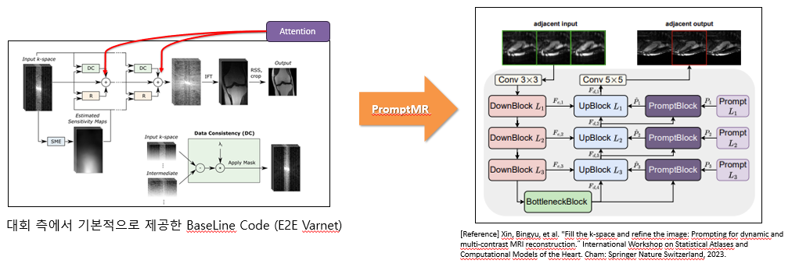
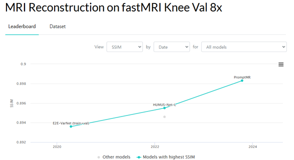
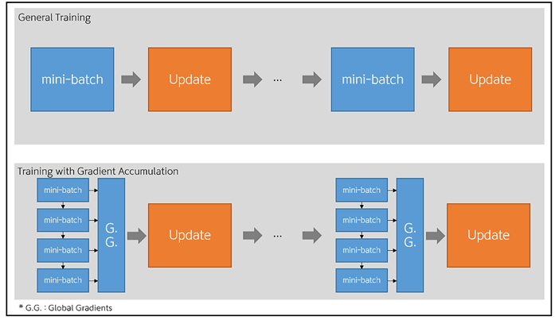
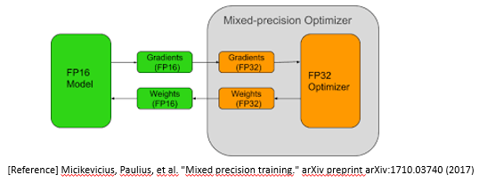
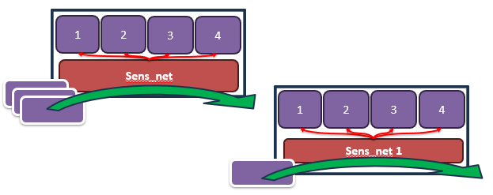
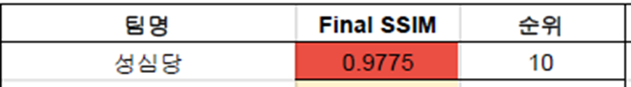

---

layout: single  
title: "2024 SNU FastMRI Challenge 프로젝트"  
categories: Projects
excerpt: "포트폴리오 프로젝트 상세 설명 페이지"  
author_profile: true  
toc: true  
toc_label: "Table of Contents"  
toc_icon: "list-alt"  
header:  
  overlay_image: /assets/images/2024SNU_FastMRI-header.jpg  
  overlay_filter: rgba(0, 0, 0, 0.5)  
  caption: "Photo credit: [Unsplash](https://unsplash.com)"  
  actions:  
    - label: "GitHub Repository"  
      url: "https://github.com/sawo0150/"  
classes: "text-white"  

---

# 팀 프로젝트 - 2024 SNU FastMRI Challenge 프로젝트

---

## 소개
본 프로젝트는 2024 SNU FastMRI Challenge의 일환으로, undersampled K-space 데이터를 기반으로 고해상도 MRI 이미지를 생성하는 모델을 개발하는 것입니다. 8GB GPU VRAM 제한을 고려해 모델 경량화 전략을 활용했으며, 최신 SOTA 모델인 PromptMR을 적용하여 높은 성능을 구현했습니다.

---

### 기간 / 인원, 역할
- **대회 일정**: 24.06 ~ 23.08.23
- **인원**: 3인 팀 프로젝트

### Language / Tool (Library) / OS
- **Language**: Python
- **Library/Tool**: Pytorch
- **OS**: Ubuntu 20.04 LTS, Jupiter Notebook server

### HardWare
- **Ubuntu 22.04 Desktop (RTX 4070)** - 개인 기숙사 컴퓨터 
- **주피터 노트북 서버 (GTX 1080)** - 서울대 정보화본부 제공

### 결과
- Leaderboaard 최종순위 : **10위/144팀** (수상X)

---

### 기타 정보
- **대회 홈페이지**: [SNU FastMRI Challenge](https://fastmri.snu.ac.kr/index.html)
- **프로젝트 GitHub**: [Sungsimdang Repository](https://github.com/sawo0150/FastMRI_sungsimdang)
  - 브랜치 별로 버전 관리함

---

## Base Model

#### PromptMR 모델 적용

- **PromptMR 모델 구조**:
  - Paper with Code 사이트를 통해 SOTA 모델을 Follow하여 프로젝트에 빠르게 적용시켰습니다.
  - MRI Reconstruction on fastMRI Knee Val 8x

  
  
---

## 사용한 Model 경량화 전략

### 1. Gradient Checkpointing – VRAM Memory
- **기존 역전파 방법**: 많은 가중치를 저장해야 하므로 높은 VRAM 메모리가 필요함.

- **Gradient Checkpointing 방법**: 가중치를 저장하지 않고 네트워크 전파만으로 계산하여 VRAM 메모리 사용을 줄임.

  

### 2. Gradient Accumulation – VRAM memory
- **효과**: 배치 크기 감소로 메모리 절약 가능.

- **설정**: 배치 크기를 1로 설정하여 메모리 사용량 최소화.

  

### 3. Mixed precision Training – Arithmetic speed
- **FP16 시스템**: 빠른 계산이 가능하지만, 역전파 시 오류가 발생할 수 있음.

- **스케일링 사용**: 데이터를 FP16 형식으로 저장하고, 계산은 FP32 형식으로 수행하여 빠른 연산과 오류 감소를 동시에 달성.

  

### 4. Sens_map – VRAM memory
- **개선 방식**:
  
  - 모든 코일 데이터를 한 번에 계산하는 방식(X)
- 각 코일 이미지를 하나씩 추가하여 계산하는 방식(O)
  
  

---

## 전체 모델 설명 Video


---

## 최종 결과
- Leaderboaard 최종순위 : **10위/144팀** (수상X)
