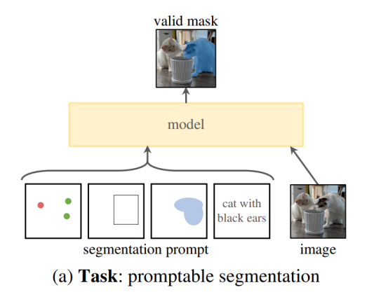
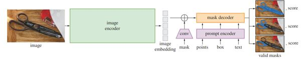
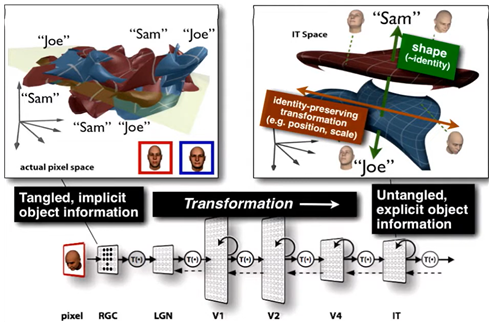
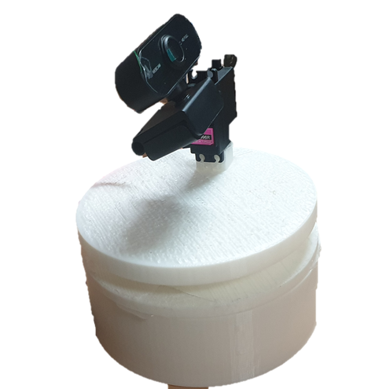

---

layout: single  
title: "RealTime-SAM2-Tracker-Camera"  
excerpt: "포트폴리오 프로젝트 상세 설명 페이지"  
author_profile: true  
toc: true  
toc_label: "Table of Contents"  
toc_icon: "list-alt"  
header:  
  overlay_image: /assets/images/portfolio-header.jpg  
  overlay_filter: rgba(0, 0, 0, 0.5)  
  caption: "Photo credit: [Unsplash](https://unsplash.com)"  
  actions:  
    - label: "GitHub Repository"  
      url: "https://github.com/sawo0150/RealTime-SAM2-Tracker-Camera"  
classes: "text-white"  

---


# RealTime-SAM2-Tracker-Camera

---

## 소개
본 프로젝트는 2024 서울대학교 LnL의 "**뇌과학으로 바라보는 인공지능**" 학생자율세미나에서 진행된 팀 프로젝트로,  
**Meta의 Segment Anything Model 2 (SAM2)** 를 활용해 다음 기능을 구현하는 것이 목표였습니다.

1. **프롬프트(마우스 클릭) 기반 객체 분할**: 사용자가 웹캠 화면에서 특정 물체를 클릭하면, SAM2가 물체의 세그먼트 마스크를 예측  
2. **실시간 추적(Tracking) & 웹캠 자동 제어**: 예측된 마스크의 중심과 화면 중앙을 비교하여, 서보모터 2축(Joint1, Joint2)을 제어  
3. **확장성**: Prompt만으로 다양한 물체를 곧바로 추적 가능

---

### 기간 / 인원, 역할
- **진행 기간**: 2024년 (2 학기 중)  
- **팀 인원**: 3명
  - **본인**: 코드 제작 및 모터 제어 코드 작성  
  - **팀원1**: SAM2 논문 조사 및 보고서 작성  
  - **팀원2**: Webcam 3D 모델링 및 브래킷 3D 프린팅  

### 1. 선행연구 및 관련 이론 탐구

1. **SAM (Segment Anything Model)**  
   
       
   
   - 이미지 영역에서 다양한 prompt(Point, Box, Mask, Text 등)에 대응하여 zero-shot segmentation이 가능합니다.
   - 기본 구조:  
     1) **Image Encoder** (MAE, ViT 기반)  
     2) **Prompt Encoder** (positional encoding, CLIP 임베딩 등)  
     3) **Fast Mask Decoder** (Transformer Decoder 변형)  
- 거대한 데이터셋(10억+ 마스크, SA-1B)을 학습하여 다양한 객체 인식이 가능해졌습니다.
  
2. **SAM 2**

           

   - 비디오에서의 segmentation을 위해 **Memory Attention** 및 **Memory Bank** 구조가 추가  
   - 프레임 간 객체의 연속적/맥락적 정보를 활용해, **시공간**에 걸친 물체 인식을 수행  
   - 마스크가 일시적으로 사라질 수 있는 동영상 상황을 고려하여, **점수(Confidence) 기반 출력**도 유연하게 처리  

3. **기존 모델과의 차별성**
   - YOLO, U-Net 등도 객체 인식/분할에 강점을 지니지만,  
     - 비디오 전체 맥락 반영이 제한적이거나  
     - 특정 분야(의학 등)에 특화된 경우가 많아  
     - 범용적인 **foundation model**로서 즉각적인 zero-shot 적용이 어려웠습니다.  
   - **SAM 2**는 대규모 학습과 프롬프트 유연성을 통해, 다양한 물체를 실시간 추적 가능하게 합니다.

---

### 2. 이론: 뇌과학적 시각  !  


- 인간의 뇌에서, **시각 정보**는 **V1-V4, IT 피질**을 거치며 단계적으로 처리됩니다.  
- 특히, **해마(hippocampus)** 는 과거 시각 정보를 저장하고, 이를 통해 **현재와 미래**의 객체 위치를 예측하는 역할을 합니다.
- 본 연구에서의 **SAM2 + 실시간 추적 알고리즘** 역시, **과거 프레임**(메모리) 정보를 참조해 **현재 객체의 위치**를 추론하고 서보모터를 제어합니다.  
- 이렇게 **Attention 메커니즘**과 **Memory Bank**를 통해, **뇌가 시각 정보를 처리**하고 **단기-장기 기억**을 전이하는 과정(시냅스 가소성, 시스템 통합 등)을 **부분적으로 모사**하고 있습니다.

### 3. 구현 개요
#### Language / Tool / OS
- **Language**: Python 3.x  
- **Framework/Tool**: PyTorch, OpenCV, Arduino IDE  
- **OS**: Ubuntu 22.04 LTS  

#### Hardware
- **MG996R** 180도 서보모터 (2개)  
- **Arduino**로 모터 제어 신호 전송  
- **PCA9685** Servo Driver  
- **USB 웹캠** (일반 Logitech C920 또는 equivalent)  
- 3D 프린팅된 거치대로 웹캠 장착  

---

### 4. 결과
  

- 실시간으로 SAM2 모델을 통해 분할된 객체가 화면 중앙에 오도록 웹캠을 2축 서보모터로 제어 가능  
- (추가로 빠르게 움직이는 물체에 대한 추적 안정성 및 유연한 Prompt 입력 가능)

---

### 기타 정보
- **프로젝트 GitHub**: [RealTime-SAM2-Tracker-Camera Repository](https://github.com/sawo0150/RealTime-SAM2-Tracker-Camera)


---

## 주요 기능 및 데모

아래 데모 영상(YouTube)에서는 마우스 클릭으로 객체를 선택하면, 초록색 마스크가 뜨고 물체가 화면 중앙으로 이동하도록 서보모터가 구동되는 모습을 확인할 수 있습니다.

- **사용자 Prompt**:  
  - 마우스 클릭 시 `click_points` 리스트에 좌표 저장 → SAM2 인퍼런스 → **마스크(Mask)** 예측
  - 예측된 마스크의 **중심 좌표**를 찾아 **서보모터**를 제어

---

### 데모 영상 1: 웹캠 동작 (전체 구조)

[https://youtu.be/YOsFoMNbPqE](https://youtu.be/YOsFoMNbPqE)

### 데모 영상 2: 사물 추적

[https://youtu.be/RFHs3VO69co](https://youtu.be/RFHs3VO69co)

### 데모 영상 3: 사람 추적

[https://youtu.be/V4sBBPQ_77k](https://youtu.be/V4sBBPQ_77k)


## 고찰 (Discussion)

1. **실시간 추적과 뇌과학적 유사성**  
   - 해마(hippocampus)가 **과거 시각 정보**를 저장하여 **현재/미래의 객체 위치**를 예측하듯이,  
   - SAM2의 **Memory Bank** 구조가 **이전 프레임** 정보를 통합하고,  
   - 이를 통해 물체가 일시적으로 가려지거나 사라져도 안정적으로 추적을 유지하는 방식을 구현 가능.

2. **서보모터 제어 속도**  
   - 초당 8도 회전은 인간 눈과 비교하면 느릴 수 있으나,  
   - **실시간 대응**에는 충분하여 사용자가 카메라의 시야를 잃지 않도록 구현  
   - 뇌가 시각 정보를 빠르게 처리하고 반응하는 속도 메커니즘을 어느 정도 모사

3. **뇌의 장기 기억 모사 가능성**  
   - 현재 SAM2의 Mask Propagation은 **FIFO Queue** 기반으로 단기 메모리를 유지하지만,  
   - **해마의 기억 통합**(단기 → 장기)을 모사해, 자주 등장하거나 중요한 객체 정보를 **장기 메모리**에 저장하면 추적 성능이 한층 상승할 가능성  
   - 예: 특정 인물(가족, 친구) 등 **빈번한 객체**는 반복 등장 시 재학습·재추적을 강화

4. **모델 구조 제안**  
   - SAM2는 양방향 Transformer 기반 → **실시간성**에서 다소 부담  
   - **단방향 Transformer** 구조나 경량화 모델을 적용하면, **추적 속도 & 지연** 문제가 개선될 수 있음

---

## 결론 (Conclusion)

- 본 연구에서는 **Meta의 Segment Anything Model 2 (SAM2)** 를 이용해, **사용자 Prompt**로 세그멘테이션하고 실시간 추적을 수행하는 **Object Tracking Webcam**을 구현했습니다.
- MG996R 2축 서보모터와 Ubuntu 22.04 + Python 환경을 활용하여, **Prompt → 마스크 예측 → 서보 제어**라는 파이프라인을 완성했습니다.
- SAM2의 **오픈소스**·**prompt 기반** 특성 덕분에, 특정 데이터셋 없이도 새로운 물체를 쉽게 인식·추적할 수 있음을 확인했습니다.
- **뇌과학적**으로 볼 때, Attention·Memory Bank 구조가 시각피질·해마의 역할을 부분적으로 모사하며, 해마의 장기 기억 통합 과정을 도입한다면 더욱 강력한 추적이 가능할 것입니다.

---

## 제언 (Proposal)

1. **해마의 기억 통합 메커니즘 적용**  
   - Queue 형태 대신, **장기 메모리**(중요 객체에 대한 feature 저장) 구조 도입  
   - 과거에 추적했던 객체를 빠르게 재인식 가능

2. **단방향 Transformer**  
   - 비디오 프레임을 순차적으로 처리하는 **Online** 또는 **실시간** 환경에서,  
   - 뒤쪽 정보(미래 프레임)에 대한 Attention 없이도 안정적인 성능을 유지할 수 있도록 경량화 필요

3. **적응형 모델 업데이트**  
   - 사용자가 반복적으로 Prompt 하는 객체(즐겨찾는 물체, 반려동물 등)에 대해,  
   - **Online Fine-tuning** 또는 Feature Bank 업데이팅을 통해 인식 성능을 향상

---

## Usage

1. **프로젝트 클론**
   ```bash
   git clone https://github.com/sawo0150/RealTime-SAM2-Tracker-Camera.git
   cd RealTime-SAM2-Tracker-Camera
   ```

2. **SAM2 레포지토리 준비**  
   - [facebookresearch/sam2](https://github.com/facebookresearch/sam2) 저장소를 로컬에 클론  
   - 해당 README의 설치 안내에 따라 모델 가중치(.pth) 등을 준비

3. **하드웨어 연결**  
   - MG996R 서보모터 2축 (좌우 회전, 상하 회전)  
   - Arduino + PCA9685 → 모터 제어  
   - 웹캠 USB 연결

4. **메인 스크립트 실행**
   
   ```bash
   # Python 측
   python3 src/webcam_publisher.py
   
   # Arduino 측
   # src/arduino/arduino_code_v2/arduino_code_v2.ino 업로드
   ```
   - 웹캠 창이 뜨면, 마우스로 추적할 객체를 클릭  
   - 선택된 객체(초록색 마스크)가 화면 중앙에 오도록 웹캠(서보모터)이 자동 회전

---

## Notes
- **실시간성**을 위해 GPU 환경(CUDA)이 권장됩니다.  
- 서보모터와 Arduino 간 시리얼 통신 속도(보드레이트)에 주의해야 합니다.  
- 3D 프린팅 STL 파일(웹캠 고정 브래킷 등)은 `3D_models/` 폴더 또는 별도 링크에서 공유가 가능합니다.

---

## References
## VII. 참고 문헌 (References)

- Kirillov, A., et al. (2023). **Segment Anything.** Meta AI Research (FAIR).  
  [https://ai.meta.com/blog/segment-anything-foundation-model-image-segmentation/](https://ai.meta.com/blog/segment-anything-foundation-model-image-segmentation/)  
- Xu, N., Price, B., Cohen, S., Yang, J., & Huang, T. S. (2016). **Deep interactive object selection.** CVPR.  
- Mahadevan, S., Voigtlaender, P., & Leibe, B. (2018). **Iteratively trained interactive segmentation.** BMVC.  
- He, K., Chen, X., Xie, S., Li, Y., Dollar, P., & Girshick, R. (2022). **Masked autoencoders are scalable vision learners.** CVPR.  
- Dosovitskiy, A., et al. (2021). **An image is worth 16x16 words: Transformers for image recognition at scale.** ICLR.  
- Tancik, M., et al. (2020). **Fourier features let networks learn high frequency functions in low dimensional domains.** NeurIPS.  
- Radford, A., et al. **Learning transferable visual models from natural language supervision.**  
- Ravi, N., et al. (2024). **SAM 2: Segment Anything in Images and Videos.** Meta AI Research.  
  [https://ai.meta.com/sam2/#our-approach](https://ai.meta.com/sam2/#our-approach)  
- DiCarlo, J. J., & Cox, D. D. (2007). **Untangling invariant object recognition.** Trends Cogn Sci. 
- [facebookresearch/sam2](https://github.com/facebookresearch/sam2)
