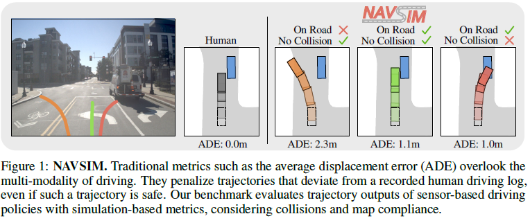
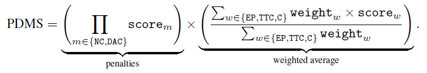
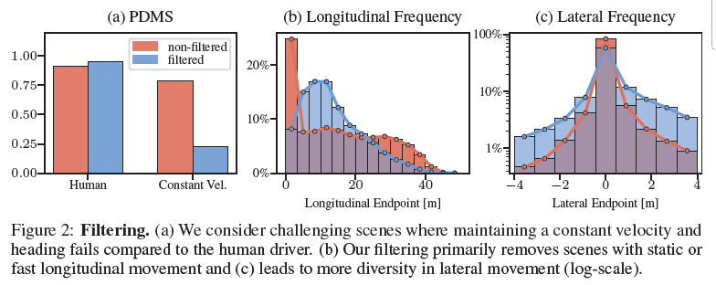
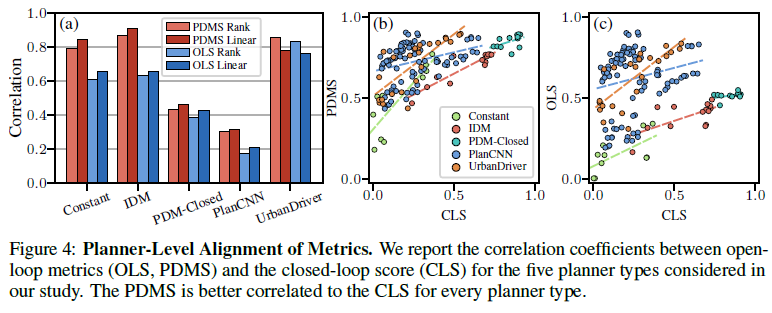
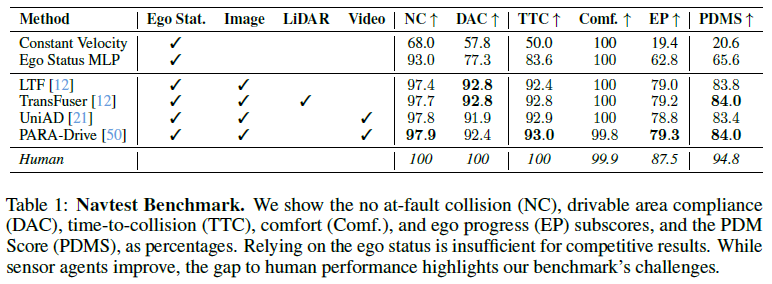
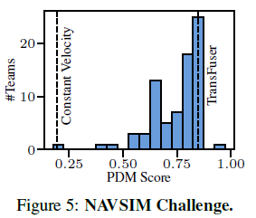

---

layout: single  
title: "[Paper-review] NAVSIM: Data-Driven Non-Reactive Autonomous Vehicle Simulation and Benchmarking"  
# categories: PaperReview
tags: [PaperReview, E2E automous driving]
excerpt: "Pap"  
author_profile: true  
toc: true  
toc_label: "Table of Contents"  
toc_icon: "list-alt"  
header:  
  overlay_image: /assets/images/portfolio-header.jpg  
  overlay_filter: rgba(0, 0, 0, 0.5)  
  caption: "Photo credit: [Unsplash](https://unsplash.com)"  
  actions:  
    - label: "GitHub Repository"  
      url: "https://github.com/sawo0150/"  
classes: "text-white"  

---

---

# [Paper-review] NAVSIM: Data-Driven Non-Reactive Autonomous Vehicle Simulation and Benchmarking

논문 리뷰에 앞서 이 논문을 읽게 된 계기부터 적어보겠습니다. 좋은 기회를 얻어 cvpr2025 E2E autonomous Driving challenge에 참가할 기회가 생겼습니다. 그래서 관련 조사를 하던 중에 Model Score를 측정하는 simulation인 NAVSIM을 공부해야하는 상황이 생겼고, 이에 대해서 읽고 정리한 내용을 블로그 내용으로 작성해서 기록용으로 작성하게 되었습니다.

[cvpr2025 AutnomousDriving Chellenge 링크](https://opendrivelab.com/challenge2025/#navsim-e2e-driving)

- [논문 링크](https://arxiv.org/abs/2406.15349){: .btn .btn--success .btn--x-large} [github 링크](https://github.com/autonomousvision/navsim?tab=readme-ov-file){: .btn .btn--success .btn--x-large}

최근 자율주행 분야에서는 주행 정책 평가 방법에 대한 많은 논의가 이루어졌습니다. 최근에 NAVSIM은 기존의 open-loop 평가와 closed-loop 시뮬레이션의 장점을 결합하여, 현실적인 주행 평가를 보다 효율적이고, 신뢰성 있게 수행할 수 있는 새로운 벤치마크를 제시했습니다. 아래 포스트에서는 NAVSIM의 핵심 아이디어와 실험 결과, 그리고 향후 과제에 대해 살펴보겠습니다.

---

## 1. 평가 패러다임의 문제점과 NAVSIM의 접근

E2E 자율주행 평가에서는 두 가지 방식이 주로 사용됩니다.

- **Open-Loop Evaluation:**  
  
  - 
  - Nuscene의 데이터 중 일부
  - 미리 기록된 실제 데이터를 기반으로 주행 궤적을 예측하고, 인간 운전자의 기록과 비교합니다.
    - 장점 :
      -  현실의 주행 상황을 잘 반영함, 평가하는데 연산량이 크게 필요 없음
    - 단점 : 
      - 제어를 통한 상황의 확장이 불가능함
      - **Blind 문제** - 대부분이 안전하거나 급격한 방향전환이 필요 없는 상황이기 때문에 외부 sensor 정보와 상관없이 전 상황들의 궤적만 가지고 판단하는 model이 높게 evaluation 됨
      - 단순히 실제 Dataset상의 운전자의 경로와 model의 경로를 비교하는 것(ADE method)은 객관적인 지표가 될 수 없음
        - 
  
- **Closed-Loop Evalutation:**  
  
  - 
    
    - Carla drivind simulator
    
  - 시뮬레이터 내에서 차량의 제어 명령이 환경에 반영되며, 충돌률, 교통 법규 준수, 편안함 등 다양한 지표를 산출합니다.
  
    - 장점 : 
  
      - 제어를 통한 상황의 확장 가능, 여러 상황에 대해서 다양하게 평가 가능 
  
    - 단점 : 
  
      - 주변의 상황에 대한 sensor Domain이 현실과 동떨어져 있음
      - Simulation돌리는데 너무 많은 연산이 필요함
  
      

**NAVSIM의 핵심 아이디어**는 이 두 평가 방식의 장점을 결합하는 것입니다.  

이에 대한 자세한 설명은 아래에 적겠습니다.
## 2. NAVSIM: 핵심 아이디어 및 평가 방식

NAVSIM은 현실적인 주행 평가를 보다 효율적이고 신뢰성 있게 수행할 수 있도록 설계된, 데이터 기반의 비반응형(non-reactive) 자율주행 시뮬레이션 및 벤치마킹 도구입니다. 기존의 두 가지 주행 평가 방식인 open-loop와 closed-loop 평가의 장점을 결합하여 현실 세계에서의 평가와 더 높은 연관성을 유지하면서도 연산 비용을 크게 줄였습니다.

### NAVSIM Simulation의 작동 방식

NAVSIM의 핵심 아이디어는 바로 **비반응형(non-reactive) 시뮬레이션**입니다. NAVSIM의 작동방식에 대해서 설명해 보겠습니다.

- Model's Task : 
  - h(=4 sec) 동안 차량이 향할 Waypoint sequence(주행경로)를 Planning
- Model's Input : 
  - 이전 Frames의 Sensor Information (Camera, Lidar 등)
    - 고해상도(1980*1280) 8개 이미지 3 Frame (1.5초 분량)
  - Ego status
    - 현재 차량의 속도, 가속도
    - 주행 목표 방향(Navigation Goal) - Left, Straight, right 중 하나로 One-Hot vector로 제공됨

- NAVSIM의 simulation 수행
  - Model이 계획한 waypoint sequence(주행경로)를 바탕으로 h초(약 4초)동안 차량이 움직이도록 계산 (non-reactive simulation)
    - 현재 차량의 상태 (속도, 가속도, position, pose) 과 차량 동역학을 통해 차량이 model의 trajectory를 4초동안 따라가는 상황을 시뮬레이션
    - 10Hz로 계산하여 한 상황에 대해서 약 40회의 상태가 나옴
    - 경로 추종은 LQR제어기, 차량 동역학은 Bicycle kinematics를 사용
    - 경로 추종기는 따로 설계해서 simulation에 적용할 수 있음
  - 그렇게 simulation해서 생성된 약 40개의 장면은 각각의 상황에서 따로 PDM score라는 평가지표를 통해 점수가 매겨지게 됨

### 평가 지표 - **PDMs (Predictive Driver Model score)**

NAVSIM 논문에서 소개한 **PDM Score(PDMS)**는 자율주행 정책을 평가하기 위한 시뮬레이션 기반 지표입니다. PDMS는 **Predictive Driver Model(PDM)**이라는, 기존의 state-of-the-art 규칙 기반(rule-based) planner에서 사용하던 평가 방식을 효율적으로 재구성한 형태입니다.

NAVSIM에서 PDMS를 사용하는 이유는 단순히 실제 사람 운전자의 궤적과의 차이를 비교하는 기존의 Open-Loop 방식(Average Displacement Error, ADE 등)이 실제 Closed-Loop 주행 성능과의 상관성이 떨어지기 때문입니다. NAVSIM은 Open-Loop과 Closed-Loop 평가의 중간 지점에서 현실성과 효율성을 동시에 확보하기 위해 시뮬레이션 기반의 PDMS를 도입했습니다.

---

### 1. PDMS 개요

PDM Score는 크게 두 단계로 나누어 계산됩니다.

1. **서브스코어(Subscores) 계산**
2. **서브스코어를 조합하여 종합 점수(PDMS)를 계산**

모든 Subscore는 `[0, 1]`의 값을 가지며, 최종 PDMS도 `[0, 1]` 범위의 값을 가집니다. 높은 PDMS 값이 더 좋은 주행 성능을 나타냅니다.

---

### PDMS의 구성 요소(Subscores)

PDMS는 다음의 두 가지로 구성됩니다:

#### (1) Penalty 점수
이 항목들은 매우 중요해서 점수가 낮으면 주행이 실패로 간주됩니다. 두 가지 주요 penalty가 있습니다:

- **충돌 회피 여부 (No Collision, NC)**  
  - 다른 차량, 보행자, 자전거 등과의 충돌 여부를 측정합니다.
  - 충돌 발생 시 `score_NC = 0`, 즉 점수가 즉각적으로 최하가 됩니다.
  - 단, 정지된 장애물과 충돌 시에는 더 부드러운 페널티(`score_NC = 0.5`)가 적용됩니다.

- **도로 준수 여부 (Drivable Area Compliance, DAC)**  
  - 차량이 도로를 벗어나지 않고 주행 가능한 영역을 유지했는지 판단합니다.
  - 주행 가능 구역 이탈 시, `score_DAC = 0`으로 강력한 페널티가 적용됩니다.

이 두 가지 항목(NC, DAC)은 **Penalty 항목**으로 분류되어 있으며, 어느 하나라도 실패하면 즉시 전체 PDMS 점수가 크게 하락하게 됩니다.

---

#### (2) 가중 평균 점수 (Weighted Average)

나머지 항목들은 차량의 주행 품질과 관련된 지표들로, 가중 평균(weighted average) 방식으로 점수에 반영됩니다.

- **Ego Progress (EP)**  
  - 차량이 설정된 경로 중심선을 따라 얼마나 전진했는지를 평가합니다.
  - NAVSIM에서는 미리 계산된 안전한 주행 경로(PDM-Closed라는 Rule-based 모션 플래너로 계산된 최대 가능 경로 길이)를 기준으로 에이전트가 달성한 진행도를 계산하여 정규화된 비율 `[0,1]`로 나타냅니다.
  - 전진거리가 충분하지 않으면 낮은 EP 점수를 받게 됩니다.

- **Time-to-Collision (TTC)**  
  - 차량이 충돌 위험까지 얼마나 시간을 여유롭게 확보했는지 평가합니다.
  - 기본값은 `1`이며, 시뮬레이션 4초 구간 내에서 미래의 충돌 예상 시간이 미리 설정된 임계값보다 작으면 즉각적으로 `0`점 처리됩니다.

- **Comfort (Comf.)**  
  - 차량 주행의 승차감과 관련된 지표로, 가속도와 jerk(가속도의 변화율)를 평가하여, 급격한 가속 및 감속 등 불편함을 유발하는 움직임을 평가합니다.
  - 일반적인 운전 수준을 초과하는 가속도나 jerk(가속도의 변화율)가 발생하면 점수가 낮아집니다.

#### PDMS 최종 계산 공식

이러한 하위 점수들을 종합하여 최종적으로 아래와 같은 방식으로 PDMS를 계산합니다.

여기서 논문에서 사용하는 가중치는 다음과 같습니다:

- EP (Ego Progress): 가중치 5
- TTC (Time-To-Collision): 가중치 5
- Comfort: 가중치 2

이러한 가중치는 NAVSIM 논문에서 제안한 기본값이며, 실험에 따르면 가중치를 다르게 설정해도 결과에 큰 영향을 주지는 않습니다.

### NAVSIM에서의 PDMS 적용 예시 및 의미

NAVSIM 논문에서는 PDMS의 사용으로 기존의 거리 기반 평가(ADE 등)가 놓치고 있던 주행의 다양한 측면(안전성, 진행성, 쾌적성 등)을 균형 있게 평가할 수 있음을 보여줬습니다. 실험 결과 PDMS는 closed-loop 평가 지표와 매우 높은 상관성을 보였으며, 특히 현실적인 주행 시나리오에서 기존 방식보다 더 정확한 주행 성능 예측을 가능하게 하였습니다.

이를 통해 NAVSIM은 기존 평가 방식 대비 현실과 더 밀접한 평가가 가능하고, 보다 객관적이고 신뢰할 수 있는 자율주행 모델의 평가 지표로 활용될 수 있음을 입증했습니다.

---

## 3. NAVSIM 데이터 및 벤치마크 구성

NAVSIM의 벤치마크 구성은 다음과 같은 단계로 이루어집니다:

### 데이터셋
NAVSIM은 OpenScene 데이터셋을 활용하여 벤치마크를 생성합니다. OpenScene은 nuPlan에서 유래된 데이터셋으로, 다양한 센서(카메라, LiDAR)의 데이터를 포함하고 있으며, HD 지도, 객체 바운딩 박스 등 다양한 정보를 제공합니다.

### 어려운 주행 상황 필터링
NAVSIM은 평가의 질을 높이기 위해 다음의 조건을 만족하지 않는 주행 상황을 제거합니다:

- 일정 속도 유지 모델(constant velocity model) 혹은 Blind Model(외부 sensor data를 참조하지 않고 오직 이전 trajectory만 참고하는 모델)이 높은 점수를 얻는 쉬운 상황
- 사람이 운전한 궤적도 낮은 점수를 얻는 데이터 오류 상황

이를 통해 총 115,000개 이상의 까다로운 주행 시나리오를 포함한 데이터셋(navtrain, navtest)을 구축하여 평가의 신뢰성을 높였습니다.

Filtering 함에 따라 종방향, 횡방향에 대한 trajectory 다양성이 늘어났음을 볼 수 있습니다.

---

## 4. 실험 및 성과 분석

NAVSIM 논문에서는 크게 두 가지 실험을 진행했습니다.

### Open-Loop와 Closed-Loop 평가의 상관성 분석

실험 결과 NAVSIM의 PDM Score는 기존 open-loop 평가 방식보다 closed-loop 평가와 훨씬 높은 상관성을 보였습니다. 특히 다양한 motion planner들을 사용한 실험에서 이러한 현상이 뚜렷하게 나타났으며, 이는 NAVSIM이 보다 현실적인 주행 정책 평가에 적합하다는 점을 시사합니다.

### 최신 E2E 자율주행 모델의 벤치마크

NAVSIM 벤치마크를 사용하여 최신 E2E 모델들을 평가한 결과, TransFuser, PARA-Drive와 같은 비교적 간단한 구조의 모델들이 UniAD와 같은 대규모 모델과 유사한 성능을 보였습니다. 이는 복잡한 구조와 많은 연산 자원을 요구하는 모델이 반드시 더 좋은 성능을 내지 않을 수도 있음을 보여줍니다.

### NAVSIM 챌린지 (CVPR 2024)

NAVSIM을 기반으로 한 CVPR 2024 챌린지에서는 13개국 143개 팀이 참가하여 463개의 다양한 모델들이 경쟁했습니다. 이 과정에서 trajectory 샘플링 및 스코어링 전략과 같은 전통적인 접근법이 다시 주목을 받는 등 흥미로운 결과들이 도출되었습니다.

주목할만한 점은 NAVSIM에서 기본으로 제공한 Transfuser Architecture를 90%의 팀이 넘지 못했다는 점이다. 

---

## 5. 결론 및 향후 과제

NAVSIM은 자율주행 정책 평가에 있어 기존의 문제점들을 효과적으로 개선하는 새로운 접근법을 제시했습니다. 향후 NAVSIM은 보다 정교한 센서 및 트래픽 시뮬레이션 기술의 발달에 따라 reactive 환경까지 확장될 수 있을 것으로 기대됩니다. 더불어 다양한 교통 규칙 준수 여부나 연료 효율성 등 새로운 평가 요소를 도입하여 평가의 다차원성을 더욱 높일 예정이라고 합니다.

