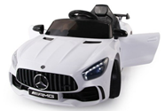
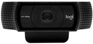
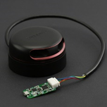
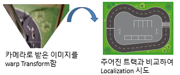
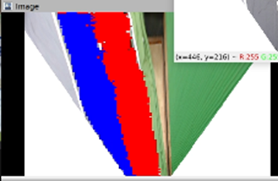
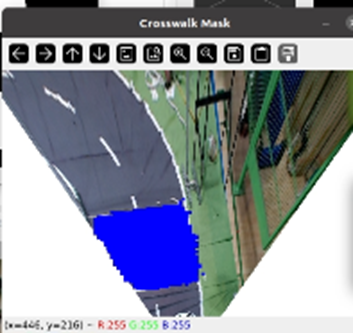
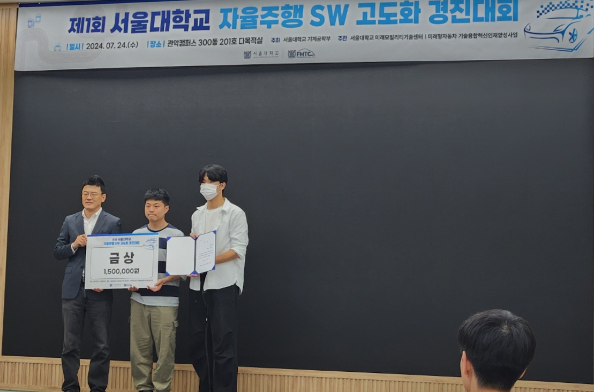

---

layout: single  
title: "자율주행 SW 고도화 경진대회 프로젝트"  
categories: Projects
tags: [자율주행, ROS]
excerpt: "포트폴리오 프로젝트 상세 설명 페이지"  
author_profile: true  
toc: true  
toc_label: "Table of Contents"  
toc_icon: "list-alt"  
header:  
  overlay_image: /assets/images/portfolio-header.jpg  
  overlay_filter: rgba(0, 0, 0, 0.5)  
  caption: "Photo credit: [Unsplash](https://unsplash.com)"  
  actions:  
    - label: "GitHub Repository"  
      url: "https://github.com/sawo0150/"  
classes: "text-white"  

---

# 팀 프로젝트 - 자율주행 SW 고도화 경진대회 프로젝트 🚗

---

## 소개
본 프로젝트는 자율주행과 관련된 다양한 과제를 수행할 수 있는 시스템을 개발하는 것을 목표로 합니다. 이를 위해 기존의 차량을 개조하여 자율주행 시스템을 설계하고 구현합니다. 주요 기능으로는 도로를 따라가는 주행, 차량 추월, 신호 인식, 그리고 주차 기능 등이 포함되어 있습니다.

---

### 기간 / 인원, 역할
- **개발**: 2024.06 ~ 2024.07.24, **최종 대회**: 2024.07.24
- **인원**: 2인 팀 프로젝트
- **역할**: 전반적인 소프트웨어 개발 (다른 팀원: 차량 개조 - 하드웨어)

### Language / Tool (Library) / OS
- **Language**: Python & C/C++
- **Library/Tool**: ROS Noetic, TensorFlow, OpenCV
- **OS**: Ubuntu 20.04 LTS

### HardWare
- **대호토이즈 벤츠 NEW GTR AMG 유아전동차**      
- **Sword 노트북 (RTX 3070)**
- **Arduino Mega**

### Sensors
- **Logitech WebCAM C920 HD PRO** x2	    
- **RPLidar A2M12 (2D 라이다)** x1               
- **HC-04 (초음파 센서)** x5
- **ELB030640 (가변저항, 조향값 체크용)** x1

### 결과
- **금상 수상 (2위)**

---

### 기타 정보
- **대회 홈페이지**: [SNU 자율주행 SW 경진대회](https://fmtc.snu.ac.kr/bbs/board.php?bo_table=education&wr_id=5)
- **프로젝트 GitHub**: [InnoDriver Repository](https://github.com/sawo0150/2024Summer_InnoDriver)

---
## Task 설명

### Task1 – 시간측정경기
- 자율주행차가 트랙을 2바퀴 주행하는 시간을 측정
- 주행 시 차선을 벗어나지 않아야 하고, 차선을 벗어날 경우 점수 삭감 또는 실격 처리됨.



### Task2 – 미션수행경기
- 1차선, 2차선의 장애물 회피
- 신호등의 신호 인식 후 횡단보도 구간까지 통과



### Task3 – 수직주차경기
- 랜덤으로 주차된 자동차 사이를 인식
- 주차 후 2초 이상 멈췄다가 OUT 지점에 도달



---

## 주요 기능 구현 및 알고리즘

## Task1 – 시간측정경기

### < 시도한 것 >

#### 첫 번째 시도:
- **알고리즘 간략 소개**: 주어진 트랙 도면을 활용한 Particle Filter로 Localization, path planning 도전

- **코드**: [Link](https://github.com/sawo0150/2024Summer_InnoDriver/blob/main/src/visionMapping/src/visionParticleFiltermapping.py)

  
  
  - **Warp Transform**: 카메라로 받은 이미지를 warp Transform 함
  - **트랙 비교**: 주어진 트랙과 비교하여 Localization 시도
  
- **발생한 문제**:
  1. Particle Filter의 연산량이 너무 큼
  2. 대략적으로 위치를 찾긴 하는데, 정확도가 떨어짐

---

#### 두 번째 시도:
- **알고리즘 간략 소개**: 전방 주시 카메라의 input을 받으면 조향 각도를 output으로 출력하는 딥러닝 모델로 도전 (ResNet 기반)
- **코드**: [Link](https://github.com/sawo0150/2024Summer_InnoDriver/blob/main/src/dlBasedDriving/src/driveForRace.py)
  - **데이터 라벨링 영상**: 미리 얻은 Data에 조향값을 Labeling 
  - (-2,-1, 0, 1, 2 중 하나 labiling)

- **주행 영상**: 잘 학습이 안된 모습

  
- **발생한 문제**:
  1. 사람이 이미지에 조향값을 라벨링하다 보니 학습 데이터의 퀄리티가 떨어짐
  2. 학습이 잘 안됨

---

#### 세 번째 시도
- **알고리즘 간략 소개**: OpenCV의 threshold를 이용하여 1차선, 2차선을 인식하고 Aheading Point를 계산 후, Stanley Path Planning을 사용하여 주행
- **코드**: [Aheading Link](https://github.com/sawo0150/2024Summer_InnoDriver/blob/main/src/missionRacing/src/raceLaneAnalizer.py) , [Stanley Link](https://github.com/sawo0150/2024Summer_InnoDriver/blob/main/src/missionRacing/src/raceDrivingNodeStanley.py)

-  **알고리즘 테스트 영상**


- **발생한 문제**:
  1. Threshold 값을 바탕으로 검은색 도로를 인식함
  2. 트랙 위치마다 조명이 다르기 때문에 하나의 임계값으로 모든 트랙을 잘 인식하지 못함

---

#### 네 번째 시도 (최종)
- **도로 인식**: WarpTransform된 카메라 이미지에서 Unet을 활용하여 1차선, 2차선을 인식합니다.
  - Threshold를 찾아내던 방식보다 더 Robust해짐
- **Local Path Planning**: 인식한 도로와 Bicycle kinematics model을 활용해 만든 mask와 내적하여 최적의 조향 각도를 찾음
  - **Kinematics**를 활용해 조향값을 찾아서 조향 정확도를 높임!

- **코드**: [Link](https://github.com/sawo0150/2024Summer_InnoDriver/blob/main/src/dlBasedDrivingV2/src/driveForRaceV5.py)

-  **주행 영상**


---

## Task2 – 미션 수행 경기

### <장애물 회피\>

- **알고리즘 간략 소개**:
  - Lidar를 활용해 얻은 point를 활용해 장애물 mask를 생성함
  - Lidar mask와 도로 segmentation mask를 비교하여 장애물이 1차선에 있는지, 2차선에 있는지 확인하고, 장애물과의 거리를 체크함
- **코드**: [Link](https://github.com/sawo0150/2024Summer_InnoDriver/blob/main/src/missionRacing/src/raceLaneAnalizerV4.py)

   
  
  *Lidar Mask와 도로 Segmentation Mask*

### <신호등 인식 & 횡단보도 인식>
- **코드**: [Link](https://github.com/sawo0150/2024Summer_InnoDriver/blob/main/src/missionRacing/src/crossWalkAnalizerV5.py)
- **알고리즘 간략 소개**:
  - **신호등 신호 인식**: OpenCV의 HoughCircleP 함수를 활용해 신호등 신호를 인식함
  - **횡단보도 신호 인식**: Unet을 활용하여 횡단보도를 인식함
    - (원래는 Yolo를 활용하고 싶었지만, 모델이 다른 모델이랑 돌리기에는 너무 무거웠고, 잘 학습이 안됐음)

  

  *횡단보도 인식한 모습 (Unet)*

-  **주행 영상**


---
## Task3 – 수직주차경기

### <수직 주차\>
- **알고리즘 간략 소개**:
  - **Rule Based** 주차 알고리즘 사용
    - (원래 A* path planner를 사용하려 했지만, 시간상 완성하지 못함)
  - **알고리즘 과정**:
    1. Lidar 상에서 오른쪽 60도 부근에 장애물을 감지될 때까지 전진
    2. 장애물 인식 후, 미리 짜놓은 순서에 따라 이동 (time based)

- **코드**: [Link](https://github.com/sawo0150/2024Summer_InnoDriver/blob/main/src/parkingLidar/arduino/parking1/parking1.ino)

-  **주행 영상**


---

## 최종 결과

  **최종 결과: 금상 (2위)**
  
