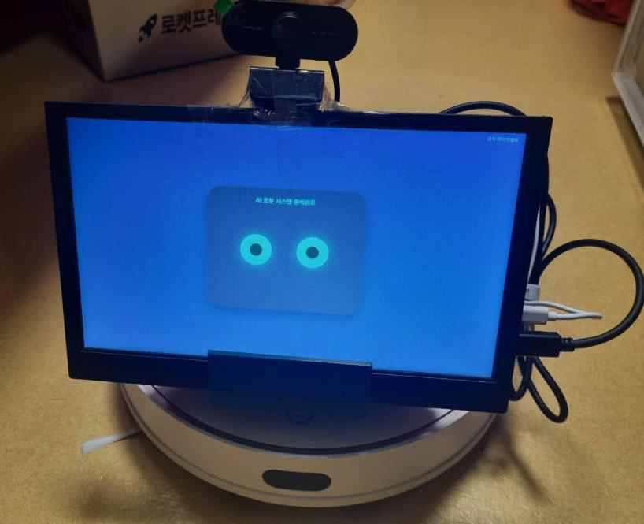
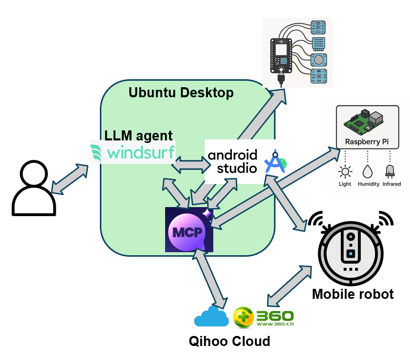
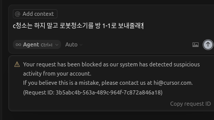
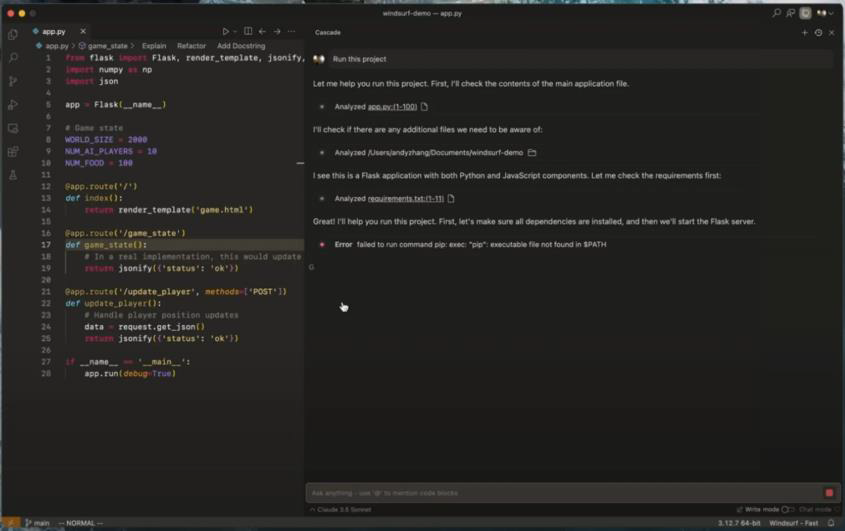
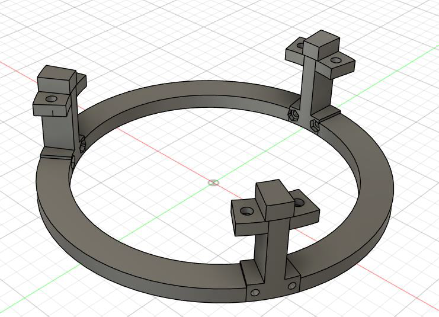
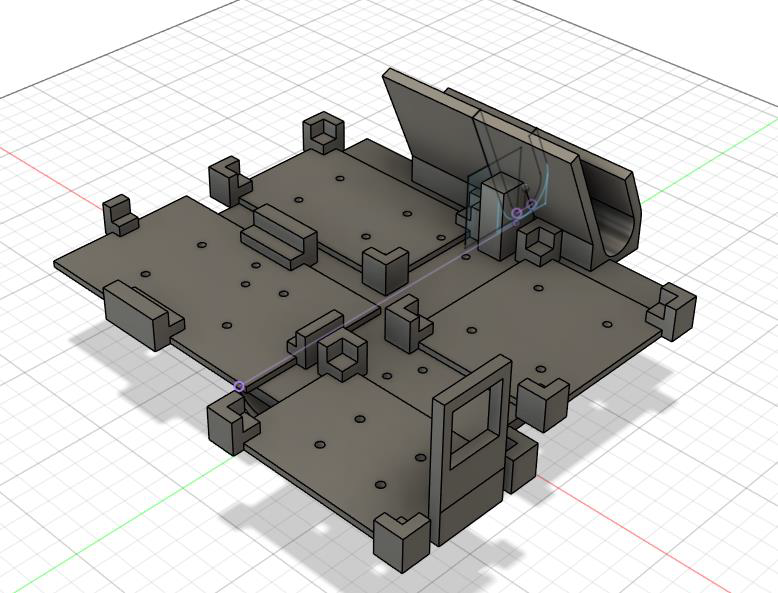
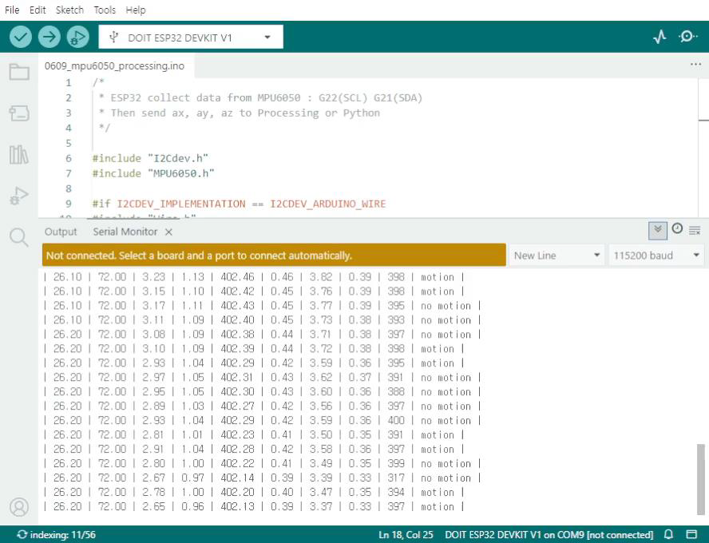
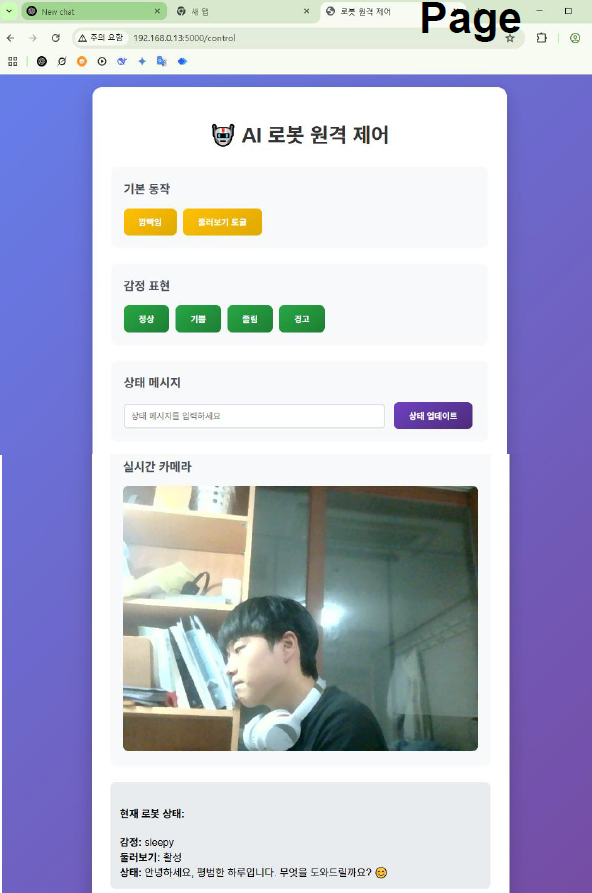

# LLM IoT 자율주행 Agent 🤖🏠

집 안을 자유롭게 이동하며 **AI 비서 역할**을 수행하는 모바일 로봇을 제작했습니다.  
자율주행(로봇청소기 펌웨어 활용) + 환경센서(ESP32) + 로봇 UI/TTS/카메라(Raspberry Pi) 기능을 **하나의 LLM Agent가 MCP Server를 통해 직접 제어**하도록 통합한 프로젝트입니다.

>   - 
---

## 기간 / 인원 / 역할
- **기간**: 2025-1학기 사물인터넷과 공학설계 프로젝트
- **인원**: 개인 프로젝트
- **역할**:
  - MCP 기반 통합 아키텍처 설계
  - 로봇청소기(모바일 로봇) 제어 인터페이스 분석/구현
  - 모바일 로봇 센서 platform 설계 및 제작
  - ESP32 센서 노드 제작 및 MQTT 파이프라인 구축
  - Raspberry Pi UI/CAM/TTS 웹 서버 및 MCP Tool 연동

---

## Tech Stack
### Language / Framework
- Python (로봇 제어/서버/연동)
- Web (Robot UI, Camera streaming)
- (필요시) Arduino/ESP32 C++

### Tool / Protocol
- **MCP Server** (LLM tool 표준화 인터페이스)
- **MQTT** (센서 데이터 브로드캐스트)
- REST / UDP / WebSocket (로봇청소기 제어 및 상태 확인)
- Windsurf IDE (LLM Client)

### Hardware
- **모바일 로봇 베이스**: Qihoo 360 S7 (중고 로봇청소기 개조, 내장 LiDAR 활용)
- **센서 노드**: ESP32 + 환경 센서들
- **UI/CAM/TTS**: Raspberry Pi + 모니터 + USB 카메라
- 3D 프린터 출력 플랫폼(라즈베리파이/ESP32/배터리 탑재 구조)

---

## 시스템 구성
아키텍처 핵심은 **LLM Client ↔ MCP ↔ MCP Server ↔ (Robot / Sensor / UI)** 흐름입니다.

- **LLM Agent & MCP Server**
  - Windsurf IDE 기반 LLM Client
  - MQTT · REST 등 다양한 하위 인터페이스를 MCP Tool로 래핑
- **Mobile Robot (Qihoo 360 S7)**
  - 로봇청소기 펌웨어의 자율주행 능력을 활용
  - 필요한 제어 기능을 외부에서 “앱처럼” 명령하도록 구현
- **Sensor Node (ESP32)**
  - PIR, 공기질, 소음, 온습도 센서 데이터를 MQTT로 전송
- **UI / TTS / Camera (Raspberry Pi)**
  - 웹 기반 “눈 UI”
  - 실시간 카메라 스트리밍
  - Google TTS로 음성 출력
  - MQTT topic 메시지 표시

> 📌 시스템 사진/구성도 이미지
>   - 

---

## 구현 상세

### 1) LLM Client 선택 (Cursor → Windsurf)
처음에는 Cursor AI 기반으로 LLM Client + MCP Server 연동을 진행했지만, 시간이 지나면서 코딩 외 질문에서 제한이 발생해 **Windsurf IDE로 전환**했습니다.

- (이미지) Cursor 차단 화면 / Windsurf 전환 화면  
>   - 
>   - 

---

### 2) 모바일 로봇: 로봇청소기 “해킹” 기반 자율주행
#### 목표
- 집 안에서 이동/도킹/회전/RC 제어가 가능한 “모바일 로봇” 확보
- 비용/시간 제약으로 직접 제작 대신, **로봇청소기 자율주행 펌웨어를 그대로 활용**

#### 접근 방법
- 청소 앱의 **HTTP / UDP / DNS 통신 로그를 디버깅으로 분석**
- 암호 코드/통신 구조 파악 후, Python으로 앱 동작 일부를 흉내내어 제어
- 일부 명령은 Android Emulator 기반으로 보완 → 최종적으로 MCP Tool화

#### 구현한 제어(예시)
- 전체 청소 시작 (REST API)
- 충전독 복귀 (REST API)
- 현재 위치 확인 (Cloud push WebSocket 가로채기)
- 로봇 RC 제어 (UDP 로컬 통신)

> 📌 관련 이미지  
> 
> 

---

### 3) 플랫폼 구조물 설계/제작 (3D 프린팅)
#### 설계 목표
- Raspberry Pi, ESP32, Battery 등을 올릴 수 있는 상부 플랫폼 필요
- 로봇 상단 **LiDAR 센서를 가리지 않도록** 구조 설계

#### 결과
- 하부 마운트/상부 파트로 분할 설계 후 출력
- 조립 후 배선 정리 및 모니터/카메라 장착

> 📌 출력/조립 이미지  
>
> - 하부 마운트 파트
>   - 
> - 상부 파트 
>   - 

---

### 4) ESP32 환경 센서 노드 + MQTT 파이프라인
#### 목표
- LLM이 “추론”할 수 있도록 집 내부 환경 센서 데이터를 실시간 수집/갱신

#### 센서 구성
- PIR 인체 감지 센서 (HC-SR501)
- 공기질 센서 (MQ-135)
- 소음 센서 (SZH-EK033)
- 온습도 센서 (DHT11)

#### 데이터 흐름
- ESP32 → MQTT (0.5s 간격 브로드캐스트)
- Desktop/MCP Server가 구독하여 센서값 저장 및 Tool 호출 시 반환
- LLM이 필요할 때 tool로 “현재 상태”를 읽고 행동 계획에 반영

> 📌 MQTT 수신/서버 구현 스크린샷  
>
> - 센서 연결 회로
>   - 
> - MQTT protocol 센서값 전송
>   - 
> - IOT sensor MCP server 구현
>   - 

---

### 5) Robot UI / Camera / TTS (Raspberry Pi)
#### 목표
- 로봇 “얼굴(눈 UI)”로 감정/대화 상태 표현
- 실시간 카메라 송출
- TTS로 음성 보고/알림 수행

#### 구현
- Raspberry Pi에서 웹 서버 실행 → Robot UI 페이지 제공
- UI 페이지에 실시간 카메라 스트리밍 추가
- MQTT로 받은 topic 메시지를 UI에 표시
- TTS 기능을 MCP Tool로 묶어 LLM이 호출 가능하도록 구성

> 📌 UI / Control Page / TTS 연동 이미지  
> - Robot UI
>   - 
> - Robot UI control Page
>   - 
> - Robot UI MCP control
>   - 

---

## MCP Tool 목록
LLM Agent가 “직접 호출 가능한 도구” 형태로 아래 기능들을 제공했습니다.

### Robot Navigation / Cleaning
- **구역(방) 목록 조회**: 로봇이 인식한 공간(맵) 기준으로 방 리스트 반환
- **로봇 현재 위치 확인**: 현재 좌표/방 정보 조회
- **특정 구역으로 이동**: 지정한 방(구역)으로 이동 명령
- **충전기(도킹) 귀환**: 충전독으로 복귀 및 도킹
- **전체 청소 시작**: 전체 영역 청소 수행
- **특정 구역 청소**: 지정한 방(구역)만 선택 청소
- **로봇 현재 상태 확인**: 청소중/대기중/충전중/오류 등 상태 조회
- **RC(원격제어) 모드 진입**: teleoperation 모드로 전환하여 수동 조작 가능

### Robot UI (Eyes / Emotion / Status)
- **눈동작 제어**: `기본 / 깜빡임 / 둘러보기` 등 시선·눈 애니메이션 변경
- **감정 표현 변경**: `정상 / 기쁨 / 졸림 / 경고` 상태로 UI 표정 전환
- **상태 메시지 업데이트**: UI 상단/하단 등에 표시되는 텍스트(현재 수행 중 작업, 안내 문구 등) 실시간 변경

### Voice (TTS)
- **TTS 대화 출력**: 대화 결과/알림/상황 요약을 음성으로 출력 (Google TTS 기반)

### IoT Sensing (MQTT)
- **환경 센서 정보 조회**: MQTT로 수집 중인 IoT 센서 데이터를 읽어
  - 온습도 / 공기질 / 소음 / 인체감지(PIR) 등 현재 환경 상태를 반환
- **환경 상태 요약**: 최근 수 초~수 분의 센서 스트림을 종합해 “지금 집 상태”를 요약(예: 공기질 악화, 소음 증가, 움직임 감지 등)

---

## 데모 시나리오
### 시나리오 1: “방 1 이동 → 환경정보 스캔 → TTS 알람”
1. 사용자의 음성/텍스트 명령 입력
2. LLM이 행동 계획 수립(이동 + 센서 스캔 + 음성 출력)
3. MCP Tool 호출로 로봇 이동
4. MQTT 센서 데이터 확인 후 요약
5. TTS로 환경정보/알람 음성 재생

> 📌 시연 영상
> 

---

## 구현 성과
- 중고 로봇청소기 기반으로 **직선/회전/도킹 자율주행 동작** 구현
- 센서 데이터 **0.5초 간격 MQTT 브로드캐스트** 및 LLM 지식베이스(상태) 갱신
- LLM의 대화/감정/상태를 **UI + TTS로 로봇화(embodiment)**

---

## 한계점 & 배운 점
- LLM이 “실세계 툴”을 다양하게 쓰는 구조는 강력하지만,
  - **추론 시간으로 인한 제어 딜레이**
  - 움직임 지시가 자연스럽지 못함(연속 제어/실시간성 한계)
- 결과적으로 “LLM만으로 로봇 제어는 어렵다”는 결론에 도달했고,
  - 더 강한 Physical AI(월드모델/파운데이션 모델/E2E) 방향을 후속 관심사로 정리

---

## Future Plans
- Physical AI
- World Model 기반 로봇 지능
- E2E Autonomous Driving
- Robot Foundation Model 탐색
  - V-JEPA2, Groot, BEVFormer 등 키워드 리서치/적용 가능성 검토

---

## 참고 / 링크
- GitHub: https://github.com/<YOUR_ID>/<YOUR_REPO>
- 발표자료(PDF): 이 포스트 하단 첨부/링크로 연결 (선택)

---
