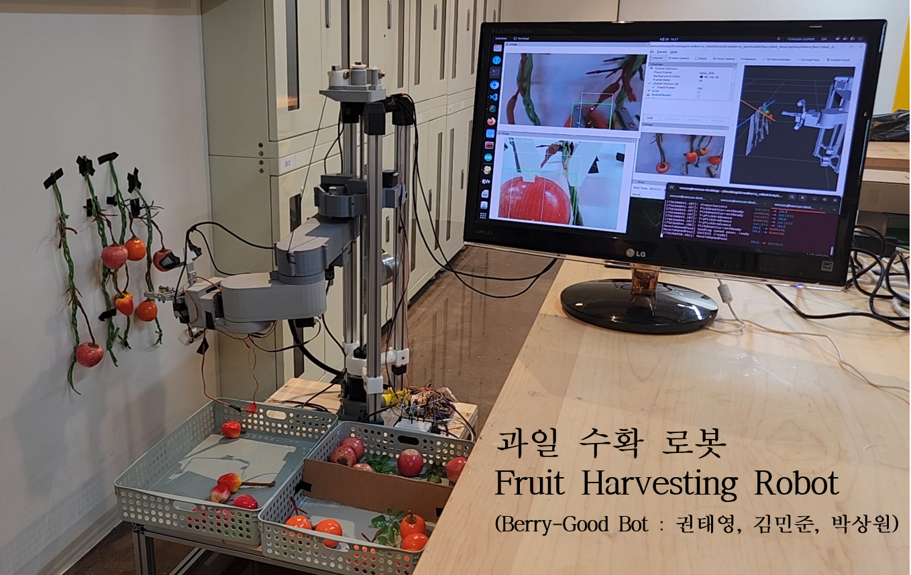
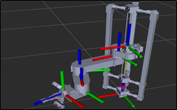
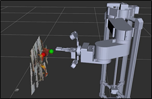
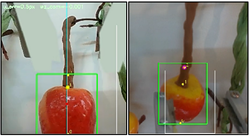
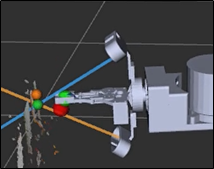
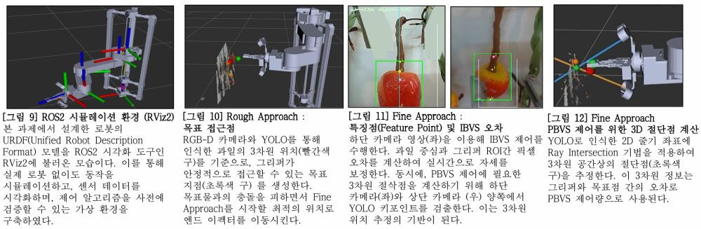
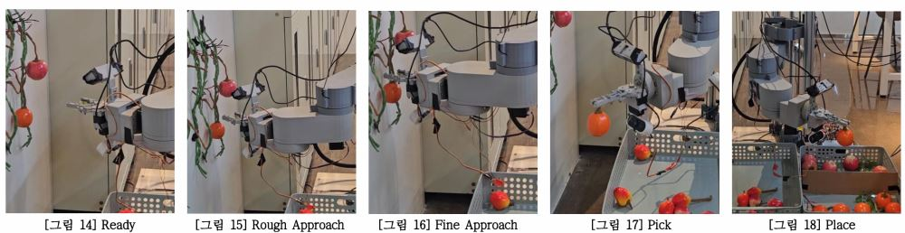
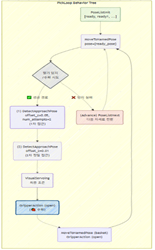
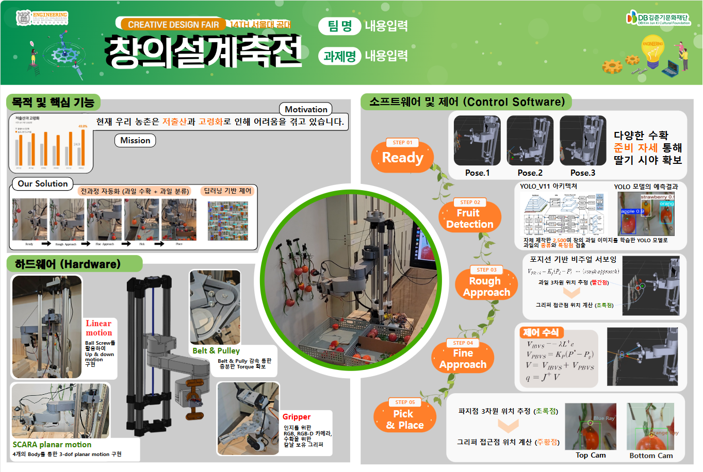
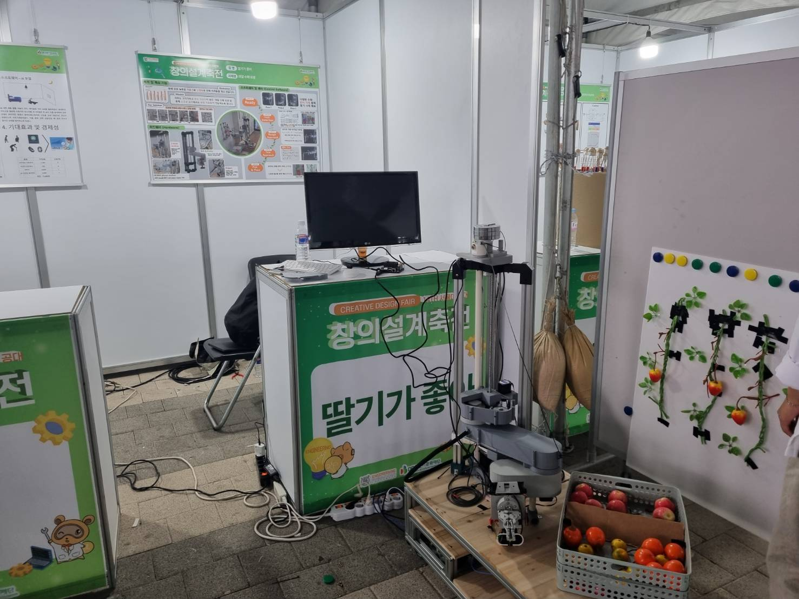

# 팀 프로젝트 - 과일 수확 로봇 (Berry-Good Bot) 🍓🤖

---

## 한 줄 소개
**국내 소규모 비닐하우스 환경을 목표로, 약 115만원 수준의 저비용 하드웨어 + ROS2 모듈형 아키텍처 + YOLO-Pose 인식 + Hybrid Visual Servoing(IBVS+PBVS) + Behavior Tree로 ‘반복 가능한 수확 루프’를 구현한 과일 수확 로봇**입니다.  

  

> 

---

## 소개 (배경 / 문제 정의)
농업 현장은 구조적 인력 부족이 심각하지만, 기존 수확 로봇은 **대규모 농장 중심 + 고가 장비(수천만 원대 이상)** 위주라 국내 소규모 비닐하우스에 적용이 어렵고 도입 부담이 큽니다.  
본 프로젝트는 **“작고 저렴하지만 실제로 동작하는 수확 자동화”**를 목표로, 아래를 핵심 방향으로 설계했습니다.

- **저비용(약 100만 원대) + 직접 제작 가능한 구조**
- **ROS2 기반 모듈형 아키텍처(확장/유지보수 용이)**
- **인식(Perception) ↔ 제어(Control) ↔ 로직(Behavior) 분리**
- **근접 구간에서도 안정적인 수확을 위한 Hybrid Visual Servoing**

---

## 기간 / 인원 / 역할
- **기간**: 2025.06.25 ~ 2025.08.22
- **팀**: 3인 (팀명: **딸기가 좋아 / Berry-Good Bot**)
- **내 역할 (박상원)**: **시스템 통합 및 제어 소프트웨어 개발(ROS2, Kinematics, Visual Servoing, Behavior Tree, Serial bridge)**  
  - HW 제작/조립(팀원), YOLO-Pose 모델 개발(팀원)과 연동하여 “수확 루프”가 실제로 돌아가도록 통합

---

## Tech Stack
### Language / Framework
- **C++ / Python 혼합**
- **ROS2** (모듈형 노드 구성)
- **Behavior Tree** (수확 시퀀스 및 예외 처리)

### Compute / OS
- **Jetson Orin Nano 8GB (JetPack 6.2)**
- **Ubuntu 22.04**

### Perception
- **YOLO-Pose (Ultralytics YOLO11 계열)**  
- 과일(딸기/사과/오렌지) 데이터 약 **2,500장 규모**로 학습  
- 특징점(키포인트) 3종: **Bottom / Top / Pick(줄기점)**

### Control
- **Kinematics / Jacobian 기반 Servo**
- **Hybrid Visual Servoing (IBVS + PBVS)**

---

## Hardware 구성
### 로봇 구조 요약
- **5-DOF 로봇 팔 + 엔드이펙터 + 4륜 알루미늄 프로파일 차체**
- 수직축(Linear): **NEMA23 + 볼스크류**, 수직 스트로크 약 **56cm**
- 평면 관절(3-DOF): **NEMA17 스텝모터 + 벨트/풀리 감속**
  - 감속비: 1/2/3번 조인트 각각 **4:1 / 5:1 / 5:1**
  - 가동범위 예: 145° / 280° / 180°
- **중력 보상(약 2kg 추)**로 1번 조인트 벤딩 하중 완화
- 엔드이펙터:
  - **MG996R 서보모터** 기반
  - **파지 + 줄기 절단을 동시에 수행**하도록 칼날/스펀지 조합 구조

### 카메라 구성 (EEF 장착)
- 상단: **RGB-D (Intel RealSense D435i)**
- 하단: **저가형 RGB 카메라(근접 시야 확보용)**

---

## 프로젝트 결과(핵심 성과)
- **저비용(총 약 1,150,000원) 구조**로 실제 동작 가능한 수확 로봇 구현
- **YOLO-Pose로 과일 종류 분류 + 키포인트(줄기) 추정**
- **근접 영역에서 RGB-D 한계를 우회**하기 위해,
  - 2카메라 기하(레이-레이) 기반으로 **줄기점 3D 추정**을 구성
- **Ready → Rough Approach → Fine Approach → Pick & Place**  
  수확 루프를 **Behavior Tree로 반복 가능하게 구현**
- 과일 종류에 따라 **바구니 분류(Pick & Place)**까지 수행

---

## 시스템 아키텍처 (모듈화 포인트)
본 프로젝트는 확장성과 디버깅 효율을 위해 시스템을 4단으로 모듈화했습니다.

1. **Serial (Jetson ↔ Arduino)**
2. **Kinematics (NamedPose / IK / Jacobian Servo Interface)**
3. **Perception (YOLO / Calibration / 3D Estimation)**
4. **Behavior Tree (수확 루프 및 Fail-safe)**

> “상위 노드가 하위 노드를 체계적으로 관리”하도록 구조화하여, 기능 교체/추가가 쉬운 형태로 만들었습니다.

---

## 1) Serial Bridge: Jetson ↔ Arduino 통신 & 하드웨어 구동
로봇 하드웨어는 **Arduino UNO + MEGA**로 구동했습니다.

- UNO: Linear joint(스텝) + wrist joint(서보) + gripper(서보)
- MEGA: 평면 3개 관절(J1,J2,J3 스텝)
- 스텝모터는 절대 엔코더가 아니라 “**스텝 누적(상대 위치)**” 기반이라,
  - 매 구동마다 **Homing(리미트 스위치)**로 기준점을 잡도록 설계
- 큰 링크/무게로 인해 급가속 시 흔들림이 커서,
  - **최대 각가속도/각속도 제한(가감속 프로파일)**을 코드에 내장해 진동 저감
- Jetson에서 pyserial로 목표 조인트를 전송하고, Arduino에서 현재 조인트 상태를 피드백

> 개발 이슈: 일부 MEGA 호환 보드 드라이버 문제로, Jetson 커널 드라이버를 빌드해 적용한 경험도 있었습니다(현장 통합 난이도 높았던 포인트).

- 코드: [Link](https://github.com/sawo0150/berry-good-bot/tree/main/berry_serial_bridge)

---

## 2) URDF + RViz2: “로봇 상태”와 “외부 환경”을 한 화면에서 디버깅
센서/인식 결과와 실제 로봇 관절 상태를 숫자만 보고 디버깅하는 것은 거의 불가능했습니다.  
그래서 CAD 기반으로 URDF를 구성하고 RViz2에서 아래를 동시에 확인하도록 했습니다.

- 목표 joint topic 기반으로 **URDF 로봇 모델 동기화 시각화**
- TF 트리 기준으로 외부 환경(과일 위치 등)과 로봇을 함께 표시

또한 Arduino 관절 각도 컨벤션과 URDF 컨벤션이 달라,
- yaml 파라미터를 조정하며 **선형 매핑(m, n) 형태로 컨벤션 보정**을 수행했습니다.
- 코드: [Link](https://github.com/sawo0150/berry-good-bot/tree/main/robot/berrybot_description)
- 

---

## 3) Kinematics Control: 3가지 “제어 인터페이스”를 Action Server로 제공
MoveIt2를 고려했지만(빌드/리소스 부담 + 자유도/환경 제약), 본 프로젝트에서는 **가벼운 인터페이스를 직접 구성**했습니다.

### (1) NamedPose
- 미리 정의한 자세(ready/basket/home 등)를 yaml에 저장
- Action으로 이름을 보내면, 현재 상태에서 목표 자세까지 완만히 이동

### (2) IK 기반 목표 포즈 이동 (IKPy)
- URDF 기반으로 IK 연산을 구성
- 위치(x,y,z)는 잘 맞지만, 자세(orientation)는 해가 불안정한 경우가 있어
  - 최종 수확 인터페이스로는 제한적으로 사용

### (3) ServoTwist (Jacobian Servoing) ✅ 핵심
- EEF의 twist(속도)를 입력으로 받아,
  - Jacobian 기반으로 joint velocity를 계산 → joint state에 반영
- 미세 서보잉이 가능해져 “근접 수확 단계”에서 가장 유효했습니다.
- 구현에 roboticstoolbox 등을 사용해 URDF 기반 Jacobian을 구성

- 코드: [Link](https://github.com/sawo0150/berry-good-bot/tree/main/berry_kinematics_control/berry_kinematics_control)

---

## 4) Perception: YOLO-Pose + Calibration + (근접 구간) 3D 줄기점 추정
### YOLO-Pose 설계
YOLO는 아래를 동시에 추정하도록 설계했습니다.
- Bounding Box (2D 위치)
- Classification (딸기/사과/오렌지)
- Keypoints 3개 (Bottom / Top / Pick=줄기점)

학습은 RTX 4070 Ti SUPER 환경에서 수행했고, 예측 결과가 라벨과 매우 유사한 수준까지 맞도록 튜닝했습니다.

- 데이터셋: [Link](https://universe.roboflow.com/berrybot-xzypx/fruit-pose-fdtan)  
- 모델/학습 파라미터: [Link](https://github.com/eric-mjk/berrybot-perception)

### Rough Approach용 3D 위치 추정 (RGB-D 기반)
- RGB-D 카메라에서 confidence 최고 bbox 선택
- bbox 내부 depth에 대해 outlier 제거 후 **상위 25% 깊이 평균** 등으로 강건화
- base_link 기준 접근점(과일점에서 일정 거리 offset)과 EEF 포즈를 반환
- 

### Fine Approach용 3D 줄기점 추정 (RGB-D 한계 우회)
근접(약 20cm 이내)에서는 RGB-D가 값이 불안정/누락되는 문제가 있어, 다른 전략이 필요했습니다.

- 하단 RGB 카메라는 줄기점이 잘 안 보이거나 conf가 떨어지는 문제가 있어,
  - **Gripper ROI 제한**
  - **HSV 기반 딸기 색 segmentation + bbox 재추정**
  - YOLO bbox와의 IoU를 결합한 score로 결과 필터링  
    (예: score = conf + IoU 형태)
- 최종적으로,  
  - 상단 RGB-D 카메라의 줄기 keypoint ray와  
  - 하단 RGB 카메라의 줄기 keypoint ray를 매칭해  
  **두 ray의 최근접점(기하 기반)으로 줄기점 3D를 추정**  
  → “가까워도 줄기점 3D를 반환”하도록 구성했습니다.
- 코드: [Link](https://github.com/sawo0150/berry-good-bot/tree/main/berry_perception)
- 
- 

---

## 5) Hybrid Visual Servoing: IBVS + PBVS 결합으로 근접 수확 안정화
본 프로젝트의 제어는 크게 두 단계입니다.

### Rough Approach (거친 접근, PBVS 중심)
- Perception에서 받은 “접근점”으로 먼저 이동
- 1회로 끝내지 않고,
  - 예: **5cm 접근 → 재인식 → 1cm 접근**처럼 단계적 접근으로 안정성 확보

### Fine Approach (정밀 접근, Hybrid)
- **IBVS**: 이미지 평면 상 특징(예: ROI 중심 x와 딸기 bbox 중심 x의 차이)을 오차로 두고 속도를 생성  
  - 가까워질수록 포즈 추정 없이도 강건하게 정렬하기 유리
- **PBVS**: 추정된 3D 줄기점과 그리퍼 기준점의 차이로 3D 속도 생성  
  - 목표점(줄기)으로의 수렴에 직관적

최종적으로 두 속도를 합성해 ServoTwist로 구동했습니다.
- `V = V_IBVS + V_PBVS`

  ​        

---

## 6) Behavior Tree: 수확 루프 & 예외 처리 로직
인식/제어가 동작해도, “언제 무엇을 실행하고 실패 시 어떻게 복구할지”가 없으면 실제 수확은 안정적으로 돌아가지 않습니다.  
그래서 전체 수확 과정을 **Behavior Tree(BT)**로 구성해 반복 가능하게 만들었습니다.

- 전체 루프(대표 구조):
  - **Ready → Rough Approach → Fine Approach → Pick & Place** (반복)
- 각 단계는 모두 Action Server 형태라,
  - BT 노드에서 래핑해 호출하는 구조로 모듈성이 좋았습니다.
- 실행은 hydra 기반 설정으로 파라미터/BT xml/node 구성을 쉽게 바꾸도록 했습니다.
- BT 예시(XML): [Link](https://github.com/sawo0150/berry-good-bot/blob/main/behavior_trees/pick_with_loops.xml)
- 

---

## 비용 분석 / 팀 역할 분담
### 비용
- 기계부품(모터, 필라멘트, 베어링): 50만원
- 전자제품(젯슨, RGB, RGB-D 카메라): 60만원
- 기타(과일 모형, 필라멘트): 5만원  
→ **합계: 115만원 **

### 팀 역할
- 권태영: 로봇 하드웨어 설계 및 제작
- 김민준: YOLO-Pose 딥러닝 모델 개발
- 박상원(나): 시스템 통합 및 제어 소프트웨어 개발

---

## Links
- **ROS2 통합/제어 코드(GitHub)**: [https://github.com/sawo0150/berry-good-bot](https://github.com/sawo0150/berry-good-bot)
- **YOLO 데이터셋(Roboflow)**: [https://universe.roboflow.com/berrybot-xzypx/fruit-pose-fdtan](https://universe.roboflow.com/berrybot-xzypx/fruit-pose-fdtan)
- **YOLO 모델/학습 파라미터**: [https://github.com/eric-mjk/berrybot-perception](https://github.com/eric-mjk/berrybot-perception)

---

## Images & Videos

> 

> 

> 

> 

> 

---
