# 팀 프로젝트 - 2025 SNU FastMRI Challenge (GeekSeek) 🧠

---

## 소개
본 프로젝트는 **가속 MRI 재구성(Accelerated MRI Reconstruction)** 문제를 대상으로, 제한된 자원(GTX1080 VRAM 8gb) 환경에서 **데이터 처리·학습 전략·모델 아키텍처**를 단계적으로 최적화하여 성능(리더보드 SSIM)을 향상시키는 것을 목표로 했습니다.  
프로젝트 전반은 아래 3가지 방향성으로 진행했습니다.

- 🛠 **Efficient Development**: 모듈화/파라미터화된 코드로 실험 전환 비용 최소화 + VRAM 최적화  
- 📊 **Full Data Exploration**: 데이터/마스크 다양성을 최대한 학습에 반영  
- 🧠 **Model Design**: 표현력 강화 & receptive field 확장(효율적인 attention 모듈 탐색)

---

## 기간 / 인원
- **기간**: 2025 (FastMRI Challenge 준비 및 실험 진행)
- **인원**: 2인 팀 (Team GeekSeek)
  - 데이터 처리(증강, 마스크 전략) 설계 및 실험  
  - 학습 전략(스케줄러/손실/안정화) 수립 및 튜닝  
  - VarNet/FI-VarNet 기반 아키텍처 탐색, attention 모듈 비교(채택/폐기 판단)  
  - Hydra 기반 config-driven 실험 파이프라인 + 재현성/메모리 안정성 확보

> 팀원: 기계공학부 박상원, 자유전공학부 신정민

---

## Tech Stack
- **Language**: Python
- **Framework**: PyTorch (FastMRI/VarNet 계열)
- **Experiment**: Hydra(YAML config), sweep 자동화
- **Training Stability/VRAM**: gradient checkpointing/accumulation/clipping, 메모리 hygiene

---

## 문제 정의 & 핵심 도전 과제
- 데이터 특성(도메인/가속도/마스크 패턴)이 혼합된 상황에서,
  - **일반화(Generalization)**를 높이고,
  - **리더보드 평가 방식과 학습 목표를 정렬**하며,
  - **제한된 GPU 자원으로도 빠르게 실험을 반복**해 성능을 끌어올리는 것이 핵심 과제였습니다.

---

# 1. Data Processing (시도 → 관찰 → 결정)

## 1) MR Augmentation (이미지 증강)
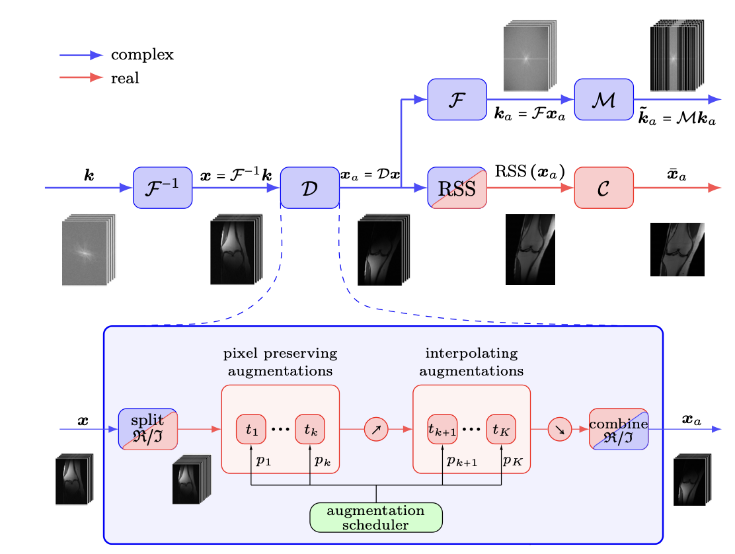

**목적**

- 모델 일반화 성능 향상

**방법**
- 증강 강도를 epoch/val_loss에 따라 스케줄링(선형/지수 등)
- MR 이미지의 노이즈 특성을 보존하기 위한 **augmentation interpolation** 고려

> 다양한 기하학적 변환(Flip/Shear/Scale/Rotation 등) 기반으로 증강을 적용했습니다.
>
> 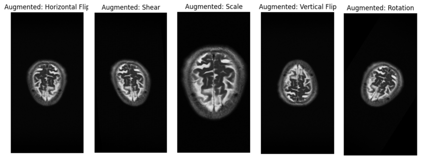

---

## 2) Mask Augmentation (샘플링 마스크 증강)
**배경**
- Private dataset에서는 다양한 마스크 패턴이 등장할 가능성이 높음

**방법**
- Facebook FastMRI repo의 mask augmentation 함수 활용
- augmentation scheduling(Linear, delay 등) 적용
- 가능한 모든 mask function을 학습에 포함

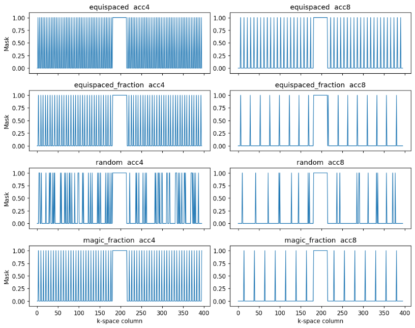

---

## 3) Center Crop (차원 축소 시도)
**목적**
- k-space 차원을 줄여 VRAM/학습 속도 최적화

### Ver1: 입력 전 crop (문제 발생)
- Image-space center crop(384×384) + zero-fill  
  - ROI 기준 loss → GT 일관성 약화, **SSIM ~0.731** 수준 관찰
- K-space center crop(384×384) 후 IFFT  
  - 기하 왜곡(Geometric distortion) 관찰, **SSIM ~0.344** 수준까지 하락

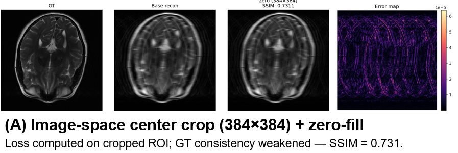

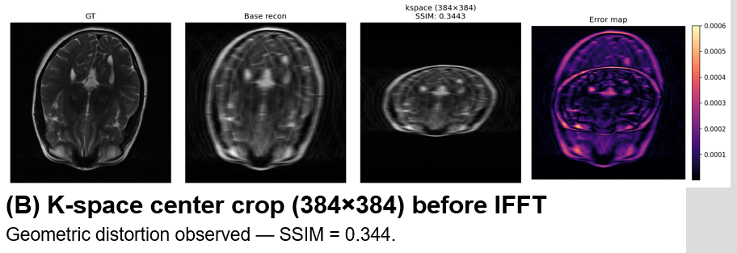

### Ver2: R-block 직전만 local crop (부분 성공 → 최종 미채택)

- Brain: 외곽이 배경에 가까워 영향 적음  
- Knee: 외곽 구조가 중요해 aliasing/성능 저하 발생

**측정된 효과**
- VRAM: **2973MB → 1443MB**
- 학습 시간: **10분/epoch → 8분/epoch**
- 단, Knee 성능 하락으로 **Final training에서는 미채택**

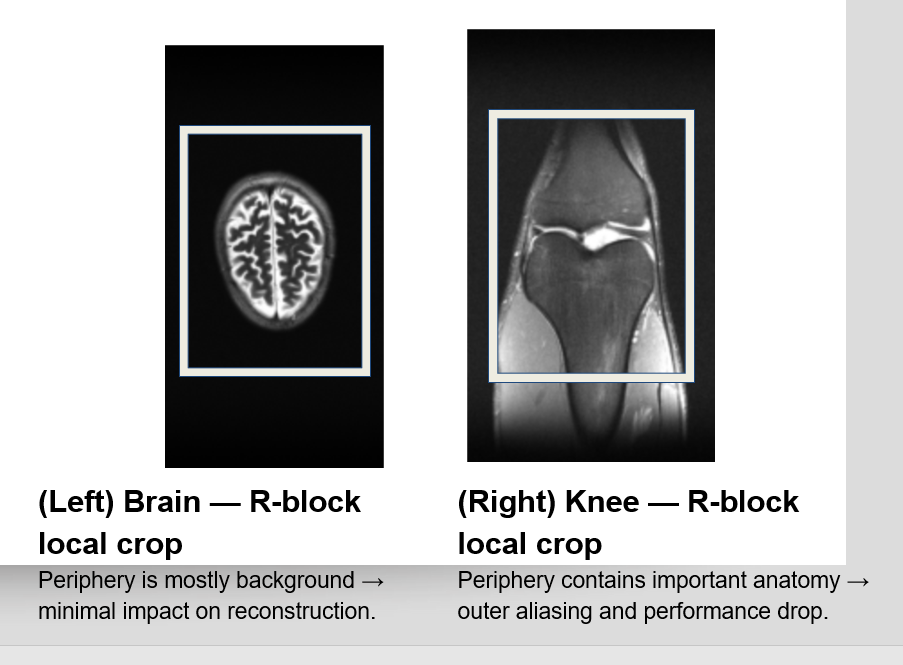

---

## 4) Coil Compression (SCC/GCC 비교)
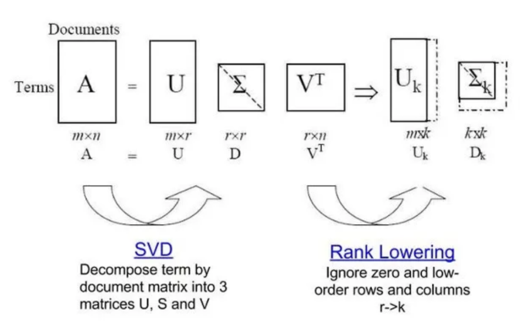

**목적**

- VRAM 사용량 저감

**시도**
- SCC(전역 SVD) vs GCC(국소 SVD)

**관찰**
- SSIM 관점에서 “압축 자체”가 GT 대비 유의미한 열화를 유발
- GCC가 SCC보다 일관되게 우수했으나, 그래도 열화 존재

**결론**

- **coil compression은 최종적으로 사용하지 않음**

---

## 5) Mask Duplicate (리더보드 스타일 정렬 전략) ⭐
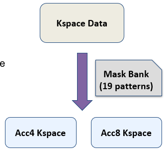

**목적**

- 학습을 리더보드 평가 마스크 스타일에 더 맞춤
- 같은 k-space가 **acc4/acc8** 둘 다로 노출되게 하여 마스크 다양성/안정성 향상

**관찰**
- dataset 내 acc4 vs acc8는 “마스크만 다른” 것이 아니라 k-space 자체도 달라 baseline 방식만으로는 불안정

**방법**
- 도메인/폭/가속도 기준으로 **고정 mask bank(19 patterns)** 구성
- 모든 k-space에 대해 **(acc4, acc8) 2개 샘플**을 고정 생성 → epoch당 iteration **×2**

**기대 효과**
- evaluation mask에 대한 견고성
- validation 안정성 향상

---

# 2. Training Strategy

## 1) LR Scheduler & Optimizer
- **ExponentialLR**
- **NAdam**

---

## 2) Loss Function (리더보드 정렬)
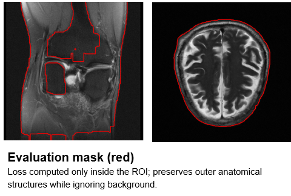

**결정**

- **SSIM + L1 (Masked Loss)**

**왜 Masked Loss인가?**

- 리더보드 평가 ROI와 학습 목표를 정렬
- 배경 노이즈 영향 감소, 의미 있는 해부학 구조에 집중

---

## 3) VRAM 최적화 & 안정화
**채택**
- Gradient Checkpointing: backward 시 재계산으로 VRAM 절감(연산 오버헤드 trade-off)
- Gradient Accumulation: 제한 VRAM에서 큰 batch 효과
- Gradient Clipping: exploding gradient 방지, 학습 안정성 개선

**배제(이유)**
- Mixed Precision: GTX1080/Pascal 환경에서 오히려 느리고 안정성 이득 미미
- DeepSpeed(CPU offload): VRAM 절감은 크지 않고 CPU↔GPU 전송이 병목

---

# 3. Model Architecture Design

## 1) Baseline: E2E-VarNet 튜닝
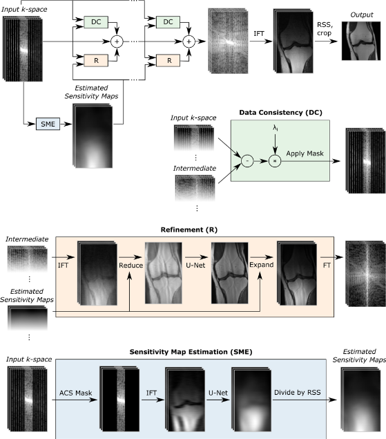

**목표**

- 공식 baseline에서 학습/하이퍼파라미터 튜닝으로 성능 최대화

**접근**
- R + DC cascades, Sensitivity Map Estimation(SME) 기반 E2E-VarNet
- 탐색 대상: cascades, chans, sens_chans

**Best config**
- **(20, 18, 8)**
- **Leaderboard SSIM = 0.9734 (50 epochs)**

---

## 2) MoE 전략 (미채택)
- 도메인/가속도 조건부 라우팅을 시도했으나
  - 성능이 낮고 수렴이 느려 **미채택**

---

## 3) 실험적 모델 (자원 제약으로 미채택)
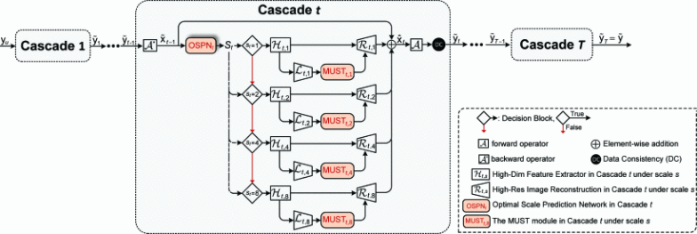

- dHUMUS-net: 글로벌 의존성 기대 vs VRAM/속도 부담 큼 → 미채택

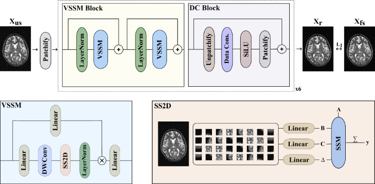

- MambaRecon: SSM 기반 글로벌 receptive field 기대 vs GTX1080에서 커스텀 커널/VRAM 이슈 → 미채택(최대 cascades≈2 수준)

---

## 4) FI-VarNet 변형 및 Attention 모듈 탐색 ⭐
### (1) FI-VarNet 파라미터 튜닝
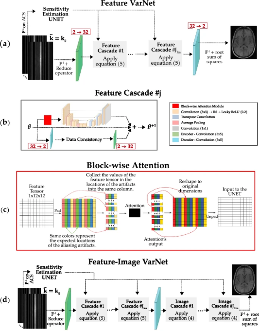

- Encoder/Decoder weight sharing: 공유가 일관되게 더 좋음
- Feature/Image cascade 조합 + Block-wise attention 실험
  - (15+3, 12, 24, 8)에서 **SSIM 0.97370**으로 채택

> 표기: (cascades_feature + cascades_image, feature_dim, unet_chans, sens_chans)

### (2) PSF-driven Deformable Attention (아이디어는 좋았으나 미채택)
- mixed acceleration(4/8) + non-equispaced mask 환경에서 aliasing 패턴이 달라지는 문제를 보완하기 위해,
  - mask에서 PSF를 유도하고 peak를 deformable attention anchor로 활용하는 “physics-aware” 아이디어를 제안/실험
- 단, 오프셋 학습으로 수렴이 느리고 VRAM/시간 부담이 커 **20일 예산 내 불가 → 미채택**

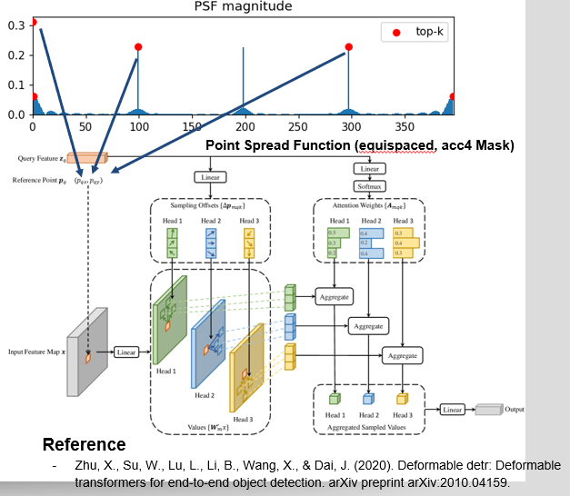

### (3) LSKA (Large Separable Kernel Attention) ✅ 최종 채택

- LKA의 O(k²) 비용 문제를 1×k + k×1 separable로 바꿔 O(2k)로 효율화
- 성능/파라미터/속도 균형이 좋아 최종 채택
- **Leaderboard SSIM = 0.9744 (50 epochs)**

---

# 4. Development Details (실험 생산성)

## 1) 개발 철학
- **Modularity & Low Coupling**: 모듈 독립성 확보(기능 on/off 안전)
- **Config-Driven Training (Hydra)**: YAML 단일 소스, override로 실험 스위칭
- **Reproducibility by Design**: checkpoint에 모델/옵티마이저/args 저장 → 재개/재현 용이
- **Memory Hygiene**: 큰 텐서의 lifetime 관리 + CUDA fragmentation 방지(장시간 학습 안정)

---

## 2) 시각화 & 튜닝 툴링
- Metric accumulator: acc(4/8) × {Brain, Knee}로 train/val loss & SSIM 추적
- Error maps: GT/Reconstruction/Error로 실패 모드 탐지
- Effective receptive field: k-space gradient map으로 receptive field 성장 비교
- Sweeps: 자동화 실험으로 비교 일관성 유지

---

# 5. 최종 결과
- VarNet 튜닝 및 FI-VarNet 변형, attention 모듈(LSKA) 채택을 통해
  - **Leaderboard SSIM을 0.9744(50 epochs)까지 향상**시켰습니다.
  - 최종순위 7등

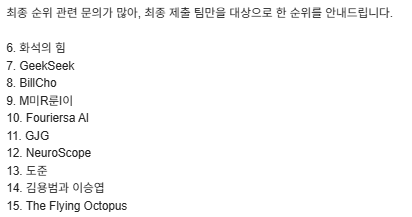

---

# 6. 회고 (배운 점)
- “좋아 보이는 최신 아이디어”라도 **자원 제약(VRAM/속도)과 수렴 특성**을 함께 봐야 실제 프로젝트에서 성과로 이어짐
- 리더보드 성능을 올리려면 모델만이 아니라,
  - **평가 방식과의 정렬(ROI/mask), 데이터 노출 전략(mask duplicate), 실험 생산성(Hydra/sweeps)**이 같이 최적화되어야 함
- Knee처럼 외곽 구조가 중요한 도메인에서는 단순한 crop 최적화가 **치명적 성능 저하**로 이어질 수 있어 “도메인별 검증”이 필수

---

## 참고 자료

> 

---
