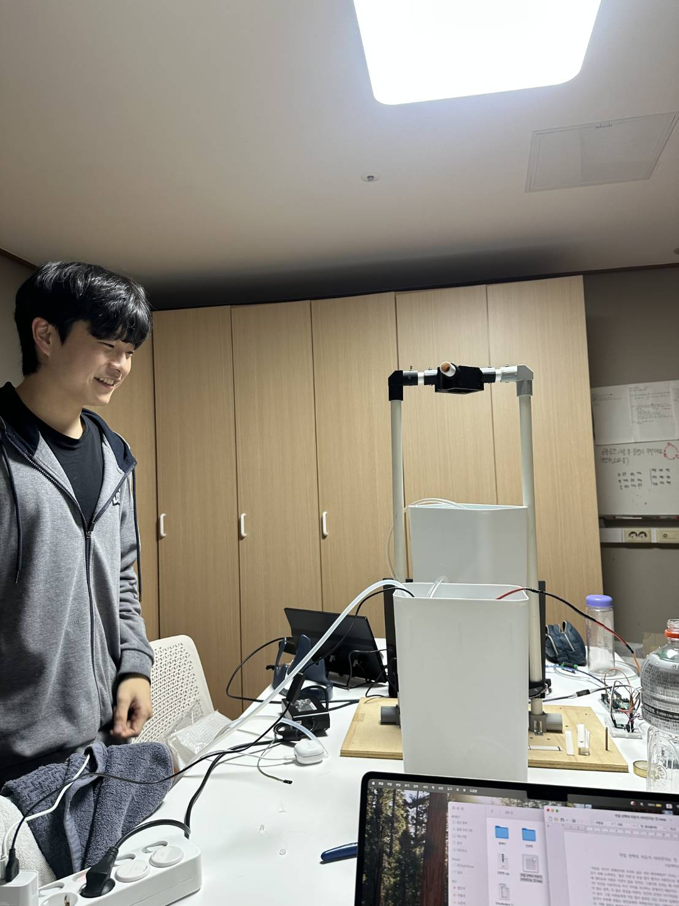
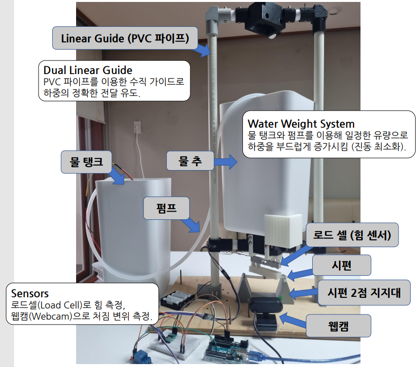
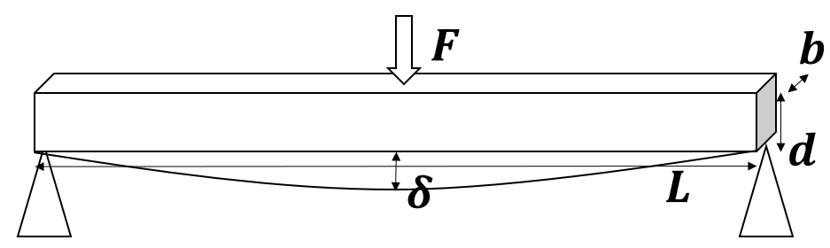
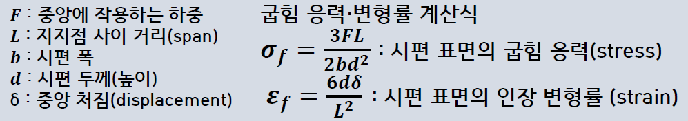
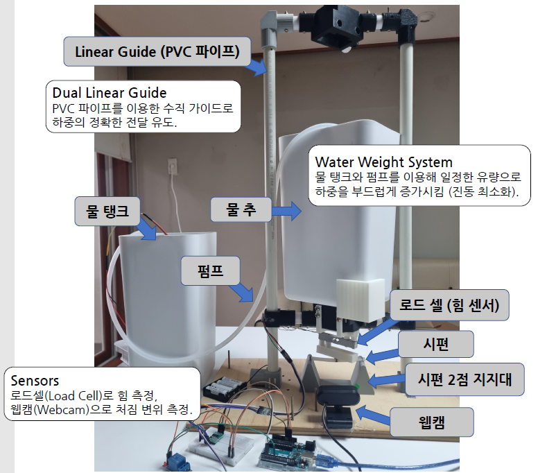
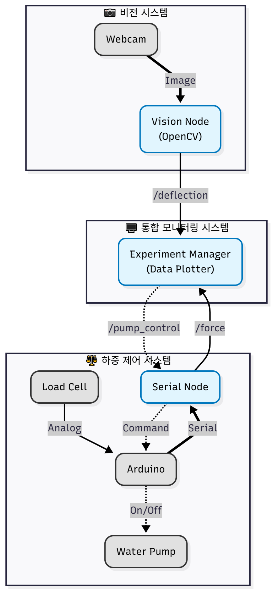
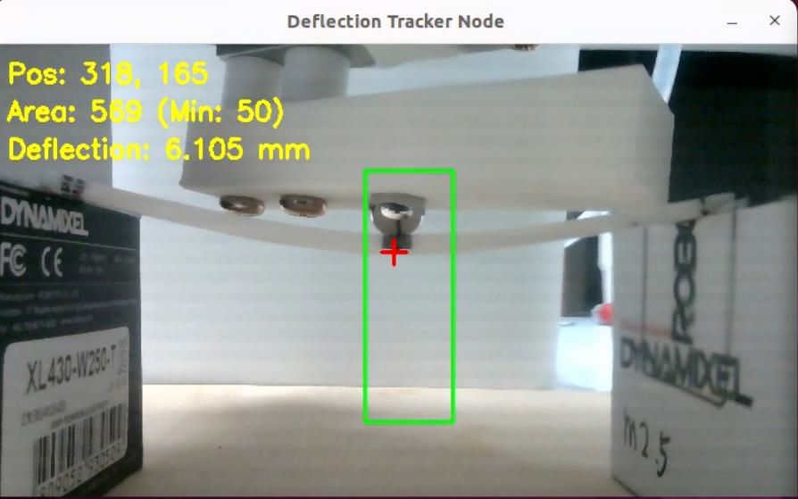
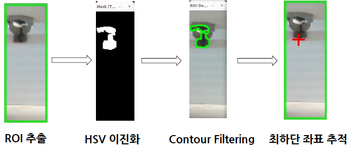
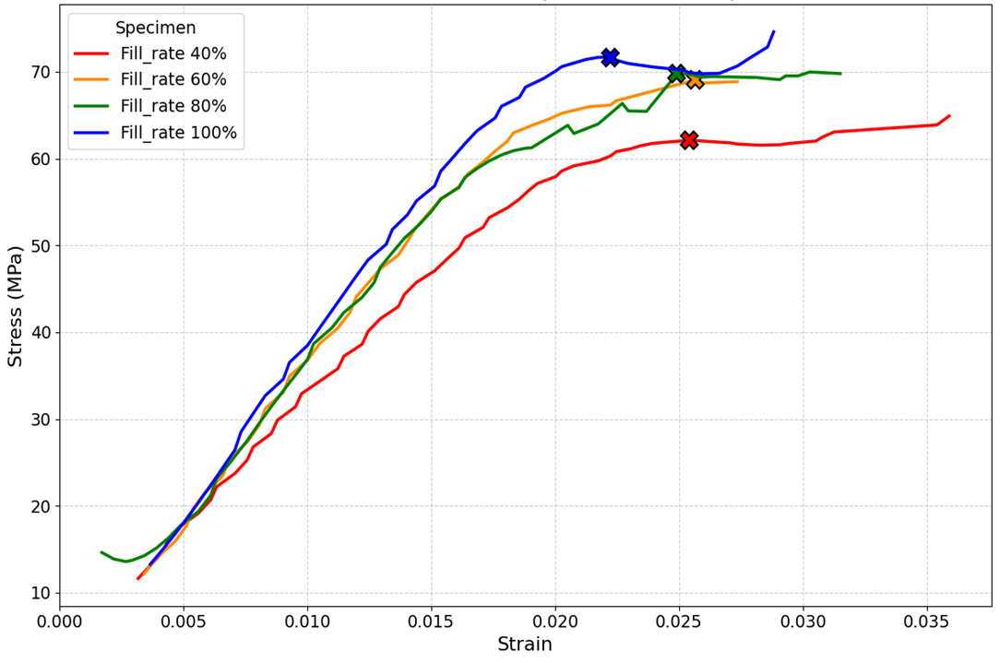
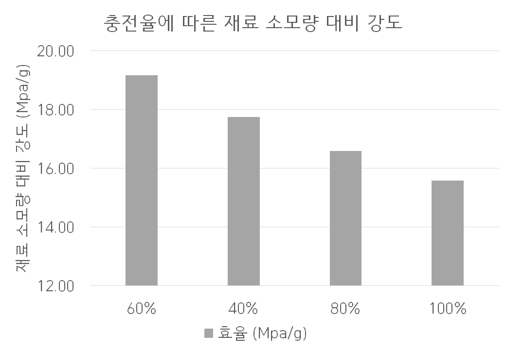

# 초저비용 3점 굽힘 시험기 개발 및 3D 프린팅(PLA) 충전율 효율 분석 🧪🛠️

> **한 줄 요약**: 약 **4만 원** 수준의 물 추(중력) 기반 3점 굽힘 시험기를 설계/제작하고, **충전율(40/60/80/100%)**에 따른 **굽힘 강도·강성·단위질량당 효율(MPa/g)**을 비교해 “가성비 최적 충전율”을 도출했습니다. 
>
> 

---

## 1) 프로젝트 소개

3D 프린팅에서 **충전율(infill)** 은 강도와 경제성(출력 시간/필라멘트 소모량)을 동시에 좌우하는 핵심 변수입니다. 하지만 기존의 상용 **만능재료시험기(UTM)** 는 가격과 접근성 문제가 커서 학생 연구 환경에서는 장비 확보가 어렵습니다.

본 프로젝트는 이런 제약을 해결하기 위해,
- **물 추(중력) 방식**으로 하중을 부드럽게 증가시키는
- **초저비용 3점 굽힘 시험기**를 직접 설계/제작하고,
- PLA 시편의 충전율 변화가 **강도·강성**에 미치는 영향과,
- **강도 대비 효율(단위 질량당 강도, MPa/g)** 관점에서 최적 충전율을 찾는 것을 목표로 했습니다. 

---

## 2) 기간 / 인원 / 역할

- **기간**: 2025-2 대학글쓰기 2 - 과학글쓰기 수업 프로젝트
- **인원**: 개인 프로젝트
- **역할**
  - 초저비용 3점 굽힘 시험기 **기구 설계/제작**
  - 로드셀 + 비전 기반 **센싱/데이터 취득**
  - ROS2 기반 **실험 제어/모니터링 시스템 구성**
  - 응력–변형률 변환 및 **노이즈 제거/데이터 분석** 

---

## 3) Tech Stack

### Language / Tool / Framework
- **ROS2 기반 실험 관리 시스템**(실시간 모니터링 GUI 포함)
- Python
- OpenCV

### Hardware (Prototype)
- **물 추(중력) 하중 시스템**: 물 탱크 + 펌프를 이용해 일정 유량으로 하중을 증가(진동 최소화) 
- **Dual Linear Guide**: PVC 파이프 기반 수직 가이드로 하중 전달 안정화 
- **로드셀(힘 센서)** + **웹캠(처짐 변위 측정)** 
- **총 비용**: 약 **4만 원** (학생 제작 가능, 탁상형)

> 
>

### 연구 질문
- **PLA 3D 프린팅 시편**에서 **충전율**이 증가하면 굽힘 강도/강성은 얼마나 증가하는가?
- 같은 강도를 얻기 위해 **필라멘트 소모량** 관점에서 가장 효율적인 충전율은 무엇인가? 

### 목표
- 물 추 방식 초저비용 3점 굽힘 시험기 **설계 및 제작**
- 충전율(40/60/80/100%) 별 **최대 굽힘 응력**, **굽힘 탄성계수(강성)** 비교
- **단위 질량당 강도(MPa/g)** 기준으로 최적 충전율 도출

---

## 5) 실험 방법

### 5-1. 3점 굽힘(Three-point Bending) 개요
보의 양단을 지지하고 중앙에 하중을 가해 시편의 굽힘 강도와 강성을 평가하는 대표적인 시험입니다. 

응력/변형률 계산식은 아래와 같습니다.

### 5-2. 변인 설계
- **조작변인**: 내부 채움 밀도(충전율) 4종 → **40%, 60%, 80%, 100%**
- **종속변인**
  - 최대 굽힘 응력(강도) \(𝝈𝒚\)
  - 초기 탄성 구간 기울기(굽힘 탄성계수/강성) \(E\)
  - 단위 질량당 강도(효율) **MPa/g**
- **통제변인**
  - 소재(PLA), 시편 치수/적층 방향, 내부 채움 패턴, 레이어 높이 등 출력 조건 동일 유지 

### 5-3. 데이터 취득 & 처리
- 로드셀 + 웹캠으로 시간–하중–변위 데이터를 취득하고,
- 3점 굽힘 식으로 **stress–strain 곡선**으로 변환
- 중앙값 기반 리샘플링 + **Savitzky–Golay 필터**로 노이즈를 완화

---

## 6) 시스템 구현 포인트

### 6-1. 물 추(중력) 기반 하중 인가

페트병/하중부에 물을 일정 유량으로 채워 **하중을 연속적으로 증가**시키는 방식은,
- 저비용이면서
- 하중 증가가 매끄러워(진동 최소화)
- 초기 탄성 구간 기울기 측정에 유리하다는 장점이 있습니다. 

### 6-2. ROS2 기반 실험 관리

하중·처짐으로부터 계산된 응력–변형률을 **실시간 표시**하고 실험 상태를 제어할 수 있도록
ROS2 기반 오픈소스 구성으로 실험 관리 시스템을 구현했습니다.

### 6-3. 비전 기반 처짐(변위) 측정 알고리즘

웹캠 영상에서 ROI 추출 → HSV 이진화 → contour filtering → 최하단 좌표 추적 흐름으로 처짐을 추적했습니다.

---

## 7) 결과

### 7-1. 강도/강성 (충전율별)

제시된 결과는 아래와 같습니다.

- **40%**: \(E = 2891, MPa\), \(sigma_y = 62.1 , MPa\)  
- **60%**: \(E = 3536, MPa\), \(sigma_y = 69.0 , MPa\)  
- **80%**: \(E = 3525, MPa\), \(sigma_y = 69.7 , MPa\)  
- **100%**: \(E = 3810, MPa\), \(sigma_y = 71.7 , MPa\)

**해석**
- 충전율이 증가할수록 **굽힘 강도 및 강성 증가**
- **100% 충전**에서 최대 강도(**71.7 MPa**)

### 7-2. 효율(단위 질량당 강도, MPa/g)

단위 강도(강도/질량) 기준으로는 **60% 충전율이 최적(19.18 MPa/g)** 이었습니다. 

> ✅ 결론적으로  
> - “최대 강도”가 목표면 **100%**  
> - “가성비/효율”이 목표면 **60%** 가 가장 합리적이라는 인사이트를 얻었습니다.

---

## 8) 한계 및 개선 방향

### 한계
- 지지대 **마찰/고정력 부족**으로 파괴 구간 이후 데이터 확보에 제한이 있었음
- PLA 및 단일 인필 조건에 한정된 결과

### 개선 방향
- 지지 구조(마찰/고정력) 개선으로 파괴 이후 구간까지 안정적인 데이터 취득
- 재료(PLA 외), 인필 패턴, 적층 방향 등 변수 확장 실험

---

## 9) 프로젝트 의의

- 상용 UTM 대비 매우 낮은 비용으로도 **핵심 물성(탄성계수/항복강도 수준) 측정**이 가능한 학생용 시험기 프로토타입을 구현
- “충전율을 높이면 강도가 오른다”를 넘어서, 설계/제작 관점에서 바로 쓰기 좋은 **효율 최적점(60%)** 을 정량적으로 제시   
- 고체역학(3점 굽힘 이론) + 제작(기구/센서) + SW(ROS2/비전/데이터처리)를 한 프로젝트로 연결한 종합 실험 경험 

---

## 10) 참고문헌
- J. Liu et al., “Effect of Infill Parameters on the Compressive Strength of 3D-Printed Nylon-Based Material,” *Polymers*, 2023.   
- Y.-G. Kang et al., “Strength Variation with Inter-Layer Fill Factor of FDM 3D Printer,” *KSMPE*, 2019.   

---

## 첨부/링크

> 

- **포스터 PDF**: [Link](/assets/files/3point-bending-lowcost-poster.pdf)

- **코드/회로/도면**: [https://github.com/sawo0150/3-PointBending_Tester](https://github.com/sawo0150/3-PointBending_Tester)
